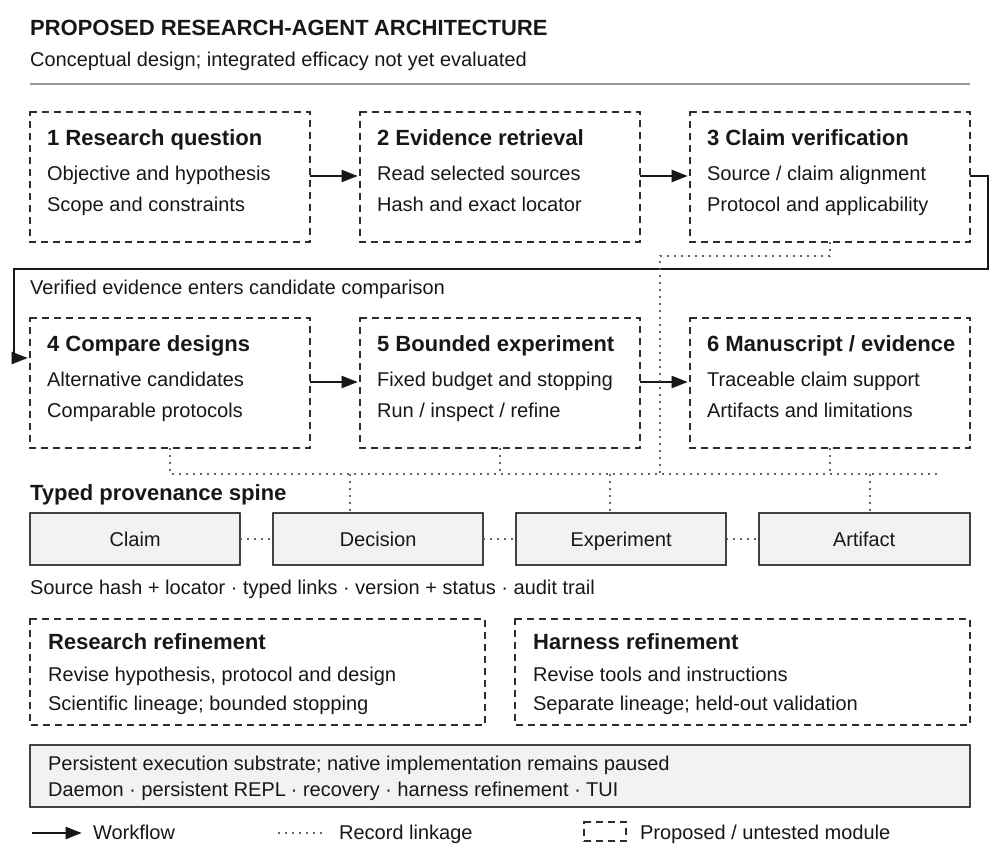
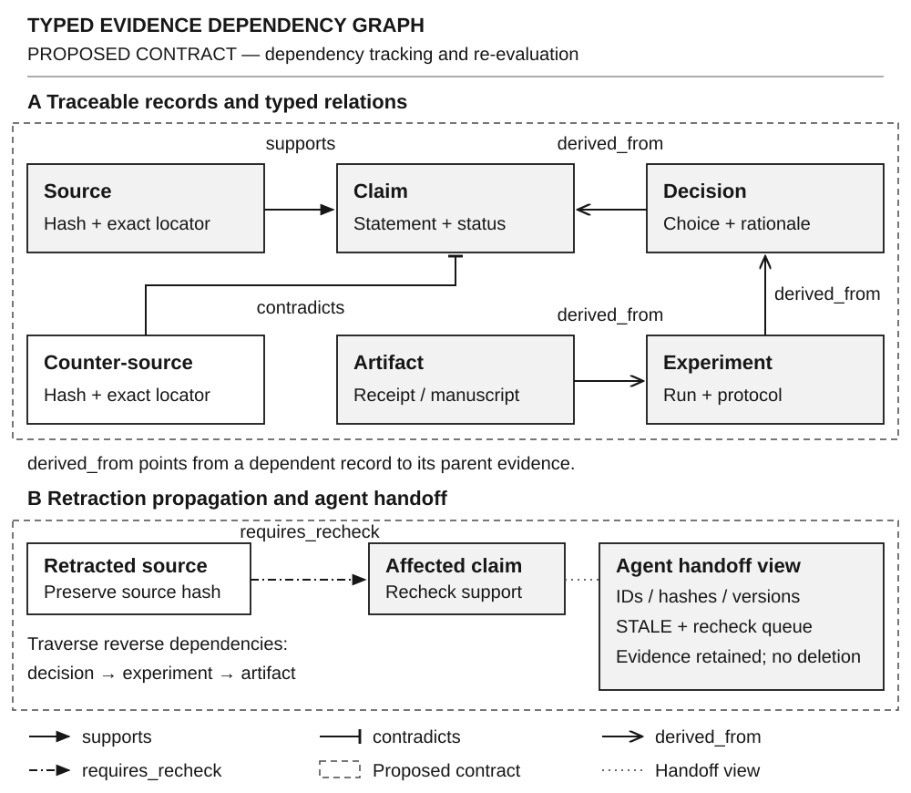
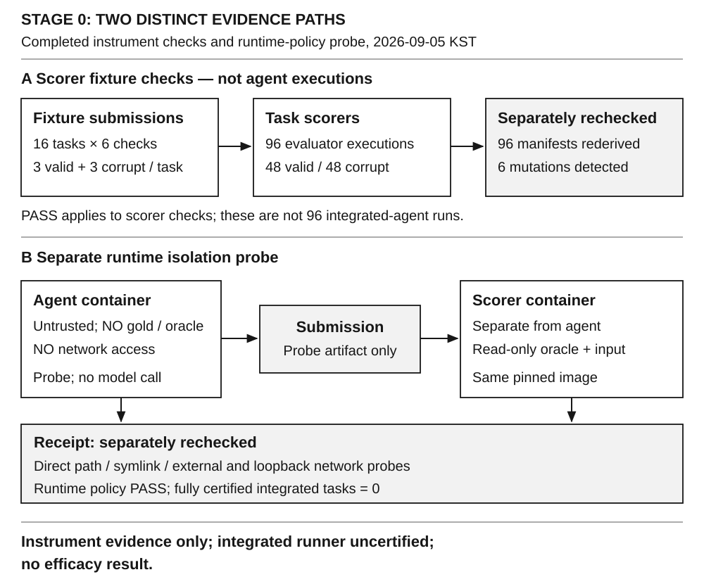

# 국문요약

자율 연구개발 에이전트의 설계에서는 개별 응답의 정확성뿐 아니라 문헌의 근거가 실험의 선택과 결과의 해석까지 유지되는지를 평가해야 한다. 본 연구는 문헌 탐색, 가설과 설계 대안의 비교, 제한된 자원에서의 실행, 결과에 따른 수정, 다른 에이전트로의 연구 인계를 연결하는 하네스를 제안한다. 제안 구조의 중심은 문헌·주장·결정·실험·산출물을 구분하는 문맥 그래프와 연구 내용의 수정 및 하네스 자체의 수정을 분리하는 갱신 절차이다. 그래프 사용 자체의 우월성을 전제하지 않고, 동일한 정보와 자원 제약에서 근거 의존성의 명시가 후속 실험 선택과 연구 인계를 개선하는지를 검증 대상으로 삼는다. 현재까지 완료된 평가는 이 효과를 측정하기에 앞서 필요한 채점기와 실행 격리의 점검이다. 네 과학 분야의 16개 과제에 대해 정답 기반 출력과 의도적으로 손상한 출력을 각각 세 번 채점한 96회 검사에서 기대한 판정이 재현되었다. 이와 별도로 동일 이미지의 분리된 실행 환경에서 정답 접근 및 네트워크 제한 정책을 점검하였다. 이 결과는 지정한 검사 입력과 환경에서의 계측 적합성만을 뒷받침한다. 통합 과제 실행기 검증과 제안 하네스의 효능 평가는 아직 완료되지 않았다. 본 논문은 완료된 계측 결과, 문헌에서 도출한 설계, 향후 검증할 가설을 분리하여 후속 실험과 프로토타입 구현의 근거를 제시한다.

**주제어:** 자율 연구개발, 에이전트 하네스, 문맥 그래프, 근거 추적, 비교 평가

# Ⅰ. 서론

## 1. 연구 문제

연구를 수행하는 에이전트는 답을 생성하는 것만으로 과제를 마치지 않는다. 어떤 문제를 풀지 정하고, 기존 연구에서 사용할 방법을 고르며, 실행할 수 있는 실험으로 구체화한 뒤, 결과가 최초의 가정을 지지하는지 다시 판단해야 한다. 이 과정에서 중요한 정보는 정답 후보만이 아니다. 채택하지 않은 대안, 선택의 근거, 관측되지 않은 조건, 실패한 실행도 다음 판단을 바꿀 수 있다. 따라서 본 연구가 다루는 문제는 이러한 정보를 보존하면서 연구의 다음 행동을 결정하는 실행 구조의 설계이다.

본 논문에서 하네스(harness)는 언어모델의 추론을 둘러싸고 도구 접근, 실행 상태, 자원 사용, 평가 및 재시작을 관리하는 구조를 뜻한다. 문맥 그래프(context graph)는 연구에 사용되는 정보 객체와 그 관계를 명시한 표현이며, 하네스의 모든 기능과 동의어가 아니다. 문헌을 저장하는 그래프가 존재한다는 사실만으로 근거에 따른 실험 선택이나 신뢰할 수 있는 연구 인계가 이루어졌다고 볼 수는 없다. 그 관계가 실제 행동을 바꾸었는지, 바뀐 행동의 결과가 비교 가능한 조건에서 관측되었는지가 별도로 필요하다.

본 연구는 학위 연구에서 도출한 설계 가설을 비교 실험으로 평가하고, 그 결과를 연구개발 에이전트 ARGO의 통합 설계와 구현 요구사항에 반영하는 것을 목표로 한다. 통합 과제 실행 경로의 검증과 하네스의 효능 평가는 이를 위한 선행 단계이며, 이후 NAIS 프로토타입에서는 검증된 설계가 실제 요구사항과 제약 아래에서 구현되는지를 별도로 평가한다. 계측 점검은 이 연쇄의 준비 단계로서, 설계의 효능 평가나 프로토타입의 구현 검증을 대신하지 않는다.

## 2. 연구 질문과 접근

본 연구의 중심 질문은 **동일한 근거와 검토 기회, 사전에 정한 자원 제약에서 근거 의존성을 명시한 연구 상태가 후속 실험의 선택과 연구 인계를 개선하는가**이다. 여기서 개선은 더 긴 설명이나 더 많은 그래프 연결을 뜻하지 않는다. 선택한 실험을 실제로 수행할 수 있는지, 선택 이유가 확인된 근거와 맞는지, 다른 에이전트가 같은 조건을 복원하여 이어갈 수 있는지로 나누어 다룬다.

이를 위해 먼저 문헌 검색과 연구 아이디어 개선, 그래프 기반 추론, 에이전트 설계 탐색, 과학 과제 평가를 서로 다른 기능으로 비교한다. 이어서 각 기능을 어떤 상태와 인터페이스로 연결할 것인지 제안하고, 비교군과 측정 단위를 정의한다. 마지막으로 현재 확보한 계측 검증 결과를 제시한다. 이 순서는 문헌에서 가능한 메커니즘을 얻되, 선행 연구의 성능 수치를 본 시스템의 성능으로 옮겨 쓰지 않기 위한 것이다.

## 3. 기여와 현재의 범위

본 논문은 근거의 상태 변화와 설계 결정·후속 실행을 연결하는 통합 하네스의 제안 구조, 이를 비교 평가하기 위한 가설, 완료된 계측 점검 결과를 제시한다. 설계상의 초점은 근거가 바뀌었을 때 어떤 주장과 결정을 다시 검토할지 명시하는 데 있다. 이 연결의 구현과 효용 평가는 후속 연구 과제이며, 현재 제시한 결과의 범위는 @tbl-scope 와 같다.

| 대상 | 현재 보고하는 내용 | 아직 주장하지 않는 내용 |
|:--|:--|:--|
| 통합 하네스 | 문헌 기반 제안 구조와 가설 | 구현 완료와 성능 우월성 |
| 과제별 채점기 | 16개 과제의 지정 입력 검사 | 에이전트의 해결 성공률 |
| 실행 격리 | 분리 환경의 정책 점검 | 전체 실행 경로의 완전한 격리 |
| 효능 평가 | 비교 조건과 추론의 요구사항 | 유의한 개선, 인과 효과, 무효과 |

: 현재 원고의 주장 범위 {#tbl-scope}

이 원고의 실측 결과 기준 시점은 2026년 9월 5일 05시 13분 55초(한국 표준시)이다. 이후의 문헌 검토와 원고 편집은 측정 결과를 추가한 것으로 계산하지 않았다. @tbl-scope 의 경계를 모든 장에 동일하게 적용한다.

# Ⅱ. 관련 연구와 설계 근거

## 1. 기능의 결합과 근거의 구분

자율 연구 하네스를 설계할 때 하나의 선행 시스템을 그대로 채택하는 방법과 여러 기능을 결합하는 방법을 구분해야 한다. 전자는 구성과 평가 범위를 맞추기 쉽지만 연구 목적에 필요한 기능을 모두 제공한다는 보장이 없다. 후자는 기능을 확장할 수 있으나 구성 요소 사이의 정보 손실, 평가 기준의 불일치, 추가 비용이 새로운 문제가 된다. 본 연구는 후자를 택하되, 구성 요소마다 해결할 문제와 실패 조건을 함께 명시하는 방식으로 결합의 근거를 제한한다.

ResearchAgent는 과학 문헌에 기초하여 연구 문제, 방법과 실험설계를 순차적으로 생성하고 검토하는 절차를 제안한다. 문헌의 인용 관계와 개체의 공출현 정보는 후보를 확장하는 데 사용되지만, 생성한 아이디어의 품질 평가가 그 아이디어의 실험적 검증을 대신하지는 않는다[@baek-etal-2025-researchagent]. 본 연구는 문제에서 실험설계로 이어지는 연결을 참고하되, 좋은 제안문을 작성하는 능력과 그 제안을 실제로 수행하는 능력을 구분한다.

OpenScholar는 검색한 문헌의 구체적인 구절과 생성한 답변의 내용을 연결하고, 추가 검색과 자기 피드백을 통해 문헌 합성을 개선한다. 저자들은 불완전한 검색, 지지되지 않는 주장, 평가 자료와 전문가 표본의 한계도 함께 논의한다[@Asai2026]. 여기서 채택하는 원리는 참고문헌의 존재가 아니라 주장에 대응하는 구절을 확인하는 것이다. 문헌 식별자, 판본과 위치를 보존하는 설계는 이 원리를 연구 결정에 확장한 제안이며, 그 자체로 실험 의존성의 정확성을 보장하지 않는다.

ScienceAgentBench는 네 분야의 44편 논문에서 구성한 102개 과제를 이용하여, 주어진 목표와 자료로 작성한 Python 프로그램의 수행을 평가한다[@chen2025scienceagentbench]. 이 평가 범위는 연구의 실행 계층을 점검하는 데 적합하지만, 백지에서의 문제 선정이나 연구 인계를 모두 측정하지는 않는다. 보다 넓은 통합 평가를 제안하는 AstaBench도 문헌·코딩·분석 및 종단 간 과제를 구분한다. 그 종단 간 과제는 AI·자연어처리 영역에서 주어진 과제 설명과 요구 단계에 대한 수행을 평가하므로, 모든 과학 분야에서 자율적으로 연구 의제를 정하는 상황과는 구별된다[@astabench2026]. 따라서 통합 벤치마크가 없다고 전제하기보다, 각 벤치마크의 과제와 채점이 본 연구의 어떤 주장을 검증할 수 있는지 판단해야 한다.

POPPER는 주가설을 하위의 반증 가능한 검정으로 연결하는 적응적 검증 절차를 제안한다. 그 통계적 보장은 가설 간 함의 관계와 과거 정보에 대한 조건부 유효성 등에 의존하며, 실패한 시도를 선택적으로 무시하는 경우에도 주의가 필요하다[@pmlr-v267-huang25n]. 본 연구는 여기서 결과를 보기 전의 선택과 결과를 본 뒤의 해석을 구분할 필요를 도출한다. 다만 이력을 기록했다는 이유만으로 POPPER의 통계적 보장을 얻었다고 주장하거나, 그 검정 방식을 모든 연구 과제에 일괄 적용하지 않는다.

| 선행 접근 | 직접 평가하는 대상 | 적용 원리와 한계 |
|:--|:--|:--|
| ResearchAgent | 문헌 기반 연구 제안 | 문제–방법–실험설계의 연결; 제안 품질과 실험 성공은 구별 |
| OpenScholar | 인용에 근거한 문헌 합성 | 주장–구절 대응; 연구 결정의 타당성은 별도 확인 |
| ScienceAgentBench | 지정 과학 과제의 코드 수행 | 실행 결과 계약; 의제 선택·인계는 측정 범위 밖 |
| AstaBench | 단계별 및 종단 간 연구 과제 | 한 실행의 요구 단계 충족; 도메인과 과제 제공 조건 명시 |
| POPPER | 순차적 가설 반증 | 선택 시점·정보 의존성 기록; 통계적 전제는 별도 충족 |

: 선행연구의 평가 범위와 본 연구로의 적용 경계. 각 행은 본문에 인용한 출판본의 방법 및 한계에 근거하며 성능 순위표가 아니다. {#tbl-literature}

@tbl-literature 의 비교에서 남는 질문은 각 기능이 존재하는지가 아니라, 기능 사이에서 근거와 조건이 보존되는지이다. 예를 들어 문헌 합성이 정확하더라도 선택한 실험이 대안 가설을 구별하지 못하면 연구 결정은 타당하지 않을 수 있다. 반대로 실행 결과가 맞더라도 원래의 연구 질문과 관계없는 과제를 수행했다면 연구 목표를 달성했다고 볼 수 없다. 이에 본 연구는 단계별 품질과 함께, 동일한 실행에서 선택·수행·갱신·인계가 연결되는지를 후속 평가 대상으로 둔다.

## 2. 그래프 기반 추론과 연구 근거의 표현

Graph of Thoughts는 추론 중 생성되는 정보를 정점과 의존 관계로 표현하고, 결합과 반복 개선을 허용한다. 또한 실행할 연산의 구조와 진행 중인 추론 상태를 구분한다[@besta2024got]. 이 구분은 연구 하네스에서 절차와 현재의 근거 상태를 분리하는 데 참고할 수 있다. 그러나 추론 경로를 그래프로 표현하는 것과 출판물의 특정 위치, 실험 조건, 결과의 사용 가능 범위를 추적하는 것은 동일한 기능이 아니다.

본 연구는 이 차이에 따라 그래프의 연결을 의미적 유사성과 근거 관계로 구분한다. 두 문장이 유사하다는 연결은 검색 후보를 찾는 데 사용할 수 있지만, 한 문장이 다른 주장을 지지한다는 관계를 자동으로 대신하지는 못한다. 또한 자료가 수정되거나 근거가 철회되었을 때 어떤 결정이 다시 검토되어야 하는지는 유사도만으로 결정하기 어렵다. 따라서 지지·반박·의존·대체 관계를 구별하는 설계를 후보로 삼는다. 이러한 표현이 추가 관리 비용을 상쇄하는지는 아직 검증되지 않았다.

## 3. 설계 탐색과 두 종류의 수정

Automated Design of Agentic Systems는 에이전트의 구성을 코드로 표현하고, 이전 설계와 평가 결과를 저장한 기록을 이용하여 새로운 구성을 탐색한다. 그 구체적 알고리즘인 Meta Agent Search는 후보 생성, 검토, 검증 자료에서의 평가, 기록 갱신을 반복한다[@hu2025adas]. 이 연구는 이전 설계와 평가 결과를 다음 설계 탐색에 활용하는 절차의 선례를 제공한다. 본 연구에서는 이 절차를 하네스 수정의 참고 대상으로 삼되, 설계 탐색에 사용하는 자료와 최종 효과 평가에 사용하는 자료를 구분하는 조건을 별도로 제안한다.

연구 문제의 가설이나 분석 조건을 바꾸는 수정과, 연구를 수행하는 하네스의 검색·기억·도구 정책을 바꾸는 수정은 평가에서 다른 의미를 가진다. 두 수정이 함께 일어나면 결과의 변화가 과학적 가설의 차이인지 실행 구조의 차이인지 식별하기 어렵다. 이에 본 연구는 연구 수정과 하네스 수정을 서로 다른 이력으로 관리하고, 비교 실험 중에는 평가 대상 하네스의 버전을 고정하는 방식을 제안한다. 이 분리는 선행 개념의 재구성과 평가 설계상의 선택이며, 구현된 비간섭 보장으로 주장하지 않는다.

## 4. 비교 연구에서 얻는 설계 원칙

위 문헌들을 결합하여 얻는 원칙은 기능의 수를 늘리는 것이 아니라, 각 기능의 입력과 출력이 다음 단계에서 어떤 권한을 갖는지 분명히 하는 것이다. 검색 결과는 읽기 후보를 제공하고, 확인된 문헌의 내용은 가설이나 설계의 근거가 된다. 설계 결정은 수행할 실험과 필요한 조건을 지정하며, 실측 결과는 그 조건이 보존되었을 때만 해당 가설의 평가에 사용한다. 마지막으로 원고의 주장은 실제로 확보된 근거의 범위를 넘지 않아야 한다. 이 단계별 구분을 제안 구조의 기준으로 사용한다.

# Ⅲ. 제안 방법과 평가 설계

## 1. 통합 하네스의 구조

제안 하네스는 연구 문제와 제약을 입력받아 문헌 탐색, 출처 확인, 설계 대안 비교, 제한된 실행, 결과 해석, 원고 및 인계 자료 갱신을 연결한다. 여기서 연구 문제와 방법을 에이전트가 제안할 수 있다는 것은 어떤 실행이든 자동으로 허용한다는 뜻이 아니다. 예산, 자료 접근, 실행 환경과 중단 조건은 별도의 제약으로 유지한다. 이 구조는 연구자가 미리 정한 정답을 따라가는 고정 흐름이 아니라, 각 판단을 재검토할 근거를 남기는 반복 절차로 설계한다.

{#fig-architecture width=160mm}

@fig-architecture 의 지속 실행 기반은 장시간 동작하는 실행 서비스, 상태를 유지하는 대화형 실행 환경, 세션 복구 및 사용자 인터페이스를 맡는다. 상위 연구 기능은 이 기반 위에서 선택과 갱신을 수행하도록 제안하였다. 기반의 실행 가능성과 상위 기능의 연구 효과는 다른 평가 대상이다.

후보 설계의 기록에는 목표, 지지 근거, 상충하는 근거, 필요한 가정, 실행 비용, 예상되는 실패, 채택 또는 보류의 이유를 포함한다. 여러 후보를 같은 기준에서 비교한 뒤 하나를 실행 대상으로 선택하되, 탈락한 후보를 삭제하지 않는다. 이후 관측이 가정을 무너뜨리면 이전 대안을 다시 고려할 수 있기 때문이다. 이때 에이전트의 서술만으로 대안이 실제 비교되었다고 인정하지 않고, 비교 대상과 기준 및 선택 시점이 남아 있는지를 확인하도록 제안한다.

## 2. 유형화된 문맥 그래프

연구 상태를 $G_t=(V_t,E_t)$로 나타낸다. 정점은 자료, 주장, 설계 결정, 실험, 산출물의 유형을 가지며, 간선은 해당 관계의 의미와 근거를 가진다. 자료 정점에는 읽은 문헌의 판본과 위치를, 실험 정점에는 조건과 실행 상태를, 산출물 정점에는 실제 생성된 결과의 식별 정보를 연결한다. 이 표현은 제안 명세이며, 현재의 전체 런타임이 이를 만족한다고 가정하지 않는다.

{#fig-graph width=160mm}

@fig-graph 에서 파생 관계는 객체의 사용 이력을 나타내며 과학적 인과관계와 동의어가 아니다. 인계 자료에는 식별자, 판본, 근거의 위치와 재검토 상태를 포함하여, 다음 담당자가 결과뿐 아니라 미해결 조건도 확인할 수 있도록 한다.

주장이 근거로부터 어느 범위까지 뒷받침되는지는 그래프 연결만으로 결정되지 않는다. 출처의 내용과 적용 조건을 확인하고, 반대 근거가 있다면 어떤 조건에서 충돌하며 그 충돌이 주장의 범위를 어떻게 제한하는지 함께 검토해야 한다. 예를 들어 다른 과제에서 얻은 성공 사례는 설계의 동기를 제공할 수 있지만 본 과제의 효과 크기를 제공하지는 않는다. 자료의 해시는 보존된 내용의 동일성을 확인하는 수단일 뿐, 그 자료의 진실성이나 추론의 타당성을 증명하지 않는다.

갱신은 기존 결과를 새 조건의 결과로 덮어쓰지 않는 방식으로 설계한다. 실험 조건이 달라지면 새 실험을 만들고 이전 실험과의 차이를 남긴다. 근거가 철회되면 그것에 의존한 주장을 재검토 대상으로 표시하고, 관련 설계 결정과 원고의 주장까지 영향을 추적한다. 그러나 의존한다고 표시된 모든 주장이 반드시 거짓이 되는 것은 아니다. 다른 독립된 근거가 남아 있는지 판단하는 검토 단계가 필요하다.

## 3. 연구 수정과 하네스 수정

연구 수정은 가설, 변수, 분석 방법과 해석을 바꾸는 과정이다. 하네스 수정은 검색 방법, 문맥 저장 방식, 실행 도구, 평가 및 복구 정책을 바꾸는 과정이다. 제안 구조에서는 두 과정을 각각 기록하고, 평가가 시작된 조건에 하네스의 후속 개선이 소급 적용되지 않도록 한다. 개선된 버전을 시험하려면 새 비교 대상으로 선언하고, 그때의 자료와 자원 조건을 다시 명시해야 한다.

하네스가 자기 결과를 검토하는 경우에는 동일한 모델이 공유하는 오류가 반복될 수 있다. 역할 이름이 다르거나 다른 세션에서 검토했다고 해서 통계적·인지적 독립성이 성립하는 것은 아니다. 따라서 자동 검토는 오류를 발견하는 보조 절차로 사용하되, 객관적으로 확인할 수 있는 출력 검사와 구분하고, 도메인 판단이 필요한 항목에는 별도의 전문가 검토를 요구하는 방향으로 설계한다.

## 4. 가설과 대안 설명

후속 실험의 가설은 @tbl-hypotheses 와 같이 설정한다. 이는 현재 관측한 효과의 요약이나 사전등록을 완료했다는 진술이 아니라, 문헌과 계측 검토로 좁힌 검증 대상이다. 성공 여부의 정의와 허용할 차이, 표본 수를 확정하기 전에는 확증적 결과를 산출하지 않는다.

| 가설 | 비교에서 관측할 차이 | 우월성 해석을 약화하는 경우 |
|:--|:--|:--|
| H1 근거에 따른 선택 | 같은 후보·근거에서 실행 가능한 후속 실험의 선택 | 추가 검토 호출이나 정보량으로 차이가 설명됨 |
| H2 연구 인계 | 새 세션이 핵심 조건과 다음 행동을 복원하는 정도 | 원문 전체를 제공한 대조군에서도 차이가 없음 |
| H3 갱신의 일관성 | 근거 철회 뒤 영향받는 주장과 결정의 식별 | 무관한 주장을 포함하거나 영향 대상을 놓침 |

: 제안 구조의 검증 가설과 대안 설명 {#tbl-hypotheses}

H1의 기본 비교는 같은 문헌과 설계 후보를 가진 비유형 기록과 유형화된 근거 기록의 차이로 좁힌다. 비유형 기록에도 지지·반박에 해당하는 원문 정보를 제공해야 한다. 그렇지 않으면 그래프 구조가 아니라 정보의 유무를 비교하게 된다. 정보 제공을 맞춘 비교 이후에 검색, 반복 검토와 하네스 수정의 추가 효과를 별도 비교로 다룬다. 모든 기능을 동시에 켜고 끄는 비교는 통합 효과를 볼 수 있지만 개별 기능의 기여를 설명하기에는 부족하다.

H2에서는 기존 세션이 생성한 문장을 다시 요약하는 능력보다, 이어받은 에이전트가 재현해야 하는 조건과 해결되지 않은 쟁점을 정확히 복원하는지를 평가한다. H3에서는 철회와 수정에 영향을 받는 객체의 정답 집합을 사전에 지정한 제한된 사례를 사용한다. 이런 사례에서의 성공은 그래프 연산의 적합성 근거가 될 수 있지만, 실제 과학적 반증을 자동으로 판별했다는 근거는 아니다.

## 5. 비교 공정성과 평가 단위

비교 공정성은 두 시스템의 모든 내부 절차를 동일하게 만드는 것으로 정의하지 않는다. 하네스가 비교 대상이라면 그 내부 구조의 차이는 의도한 개입의 일부이다. SWE-agent는 같은 기반 모델을 사용하더라도 검색·편집·관측과 이력 처리의 인터페이스가 수행 조건에 영향을 줄 수 있음을 보여준다[@yang2024sweagent]. 본 연구는 공통 실행 기반과 의도한 변경 요소를 분리하여 기술하고, 비교 시스템이 정상적으로 과제를 완료할 수 있는 경로를 보존한다.

통합 시스템 비교에서는 목표, 자료 접근 권한, 기반 모델, 자원 상한, 사람의 개입 정책과 최종 제출 규칙을 맞추되, 검색·기억·조정 경로는 각 시스템의 일부로 둔다. 기전 진단에서는 같은 문헌과 원문 정보, 검토 기회를 제공한 뒤 표현 또는 갱신 방식 하나의 차이를 더 좁게 비교한다. 통합 비교의 차이를 특정 모듈의 효과로 해석하거나, 정보가 고정된 진단을 실제 검색까지 포함한 종단 간 우월성으로 확대하지 않는다. 이러한 구분과 다음의 비용 경계는 본 연구가 제안하는 비교 계약이다.

자원 사용에는 최종 답변 생성뿐 아니라 검색, 후보 비교, 반복 검토, 재시도 및 허용된 하네스 개선을 어디까지 포함하는지 명시한다. 동일 토큰 수만을 동등한 비용으로 간주하지 않고 실제 사용량, 소요 시간과 비용을 함께 보고하도록 한다. 개발 단계의 탐색 비용과 평가 실행의 비용도 별도로 기록한다. 모든 예정·시작 실행의 상태를 보존해야 성공한 사례만의 비용이 전체 시스템의 효율로 바뀌는 것을 막을 수 있다. 실행 환경·방법·계산 자원을 공개하는 것은 재현을 위한 보고 조건이지 재현 성공 자체는 아니다[@JMLR:v22:20-303].

내용 평가와 표현 평가는 분리한다. LLM 평가자에 관한 연구에서는 답변의 위치와 장황성, 제시된 답안에 의한 추론 오류가 관측되었다[@zheng2023judge]. 따라서 문장의 선호 점수를 사실·계산·과제 계약의 적합성과 합산하여 하나의 과학적 품질 점수로 만들지 않는다. 후속 평가에서는 조건명 비공개, 제시 순서 교환, 오류가 알려진 사례의 점검, 도메인 전문가의 검토와 불일치 보고를 검토한다. 이는 아직 실시하지 않은 평가 절차이며, 같은 모델을 여러 역할로 호출하는 것을 독립적인 과학적 검증이라고 부르지 않는다.

개발에 노출된 자료와 평가용 자료, 조건 내부의 지속 기억과 조건 사이의 정보 유입을 구분한다. 지속 기억이 연구 대상이라면 이를 모두 제거하는 대신 축적이 허용되는 범위를 선언해야 한다. 정답·평가 코드에 대한 접근 차단, 초기 상태와 사람의 개입 기록은 이 범위를 점검하는 수단이다. 이 조치로 기반 모델의 사전학습 오염까지 없다고 증명할 수는 없다.

## 6. 완료된 계측 검증의 방법

현재까지 수행한 평가는 에이전트의 과제 수행 실험과 분리된 계측 검증이다. 첫 번째 검사는 과제별 채점기가 지정된 출력의 차이를 구분하는지를 확인한다. 네 분야에서 선택한 16개 과제에 대해 알려진 정답 기반 출력과 의도적으로 손상한 출력을 구성하고, 각 출력을 동일 조건에서 세 번 평가하였다. 따라서 검사 횟수는 $16\times(3+3)=96$회이다. 이는 서로 다른 96개 과제도, 모델이 생성한 96개 답안도 아니다.

손상은 과제의 출력 형식에 맞추어 구성하였다. 사용한 변환에는 표의 값 치환과 수치 변경, 이진 값 반전, 배열 및 JSON 수치 변경, 래스터 값 변경, 텍스트 비우기가 포함된다. 정답을 복사하거나 변형하여 입력을 만들었으므로 이 절차는 채점기의 양성 및 음성 대조 검사에 해당한다. 그 대조를 통과했더라도 문법적으로는 정상이나 과학적으로 부적절한 모든 출력까지 구분한다고 볼 수 없다.

{#fig-measurement width=160mm}

두 번째 검사는 평가를 위한 실행 환경의 일관성과 정답 접근의 분리이다. 요구 모듈의 로딩과 두 실행 환경의 패키지 목록을 확인하고, 동일한 이미지에서 에이전트 역할과 채점기 역할을 별도의 컨테이너로 실행하였다. 정답 경로 직접 접근과 심볼릭 링크를 통한 접근, 외부 및 루프백 네트워크 접근을 검사 대상으로 삼았다. 이 점검은 앞의 96회 채점 검사와 별도로 수행되었으며, 16개 과제 모두를 이 경로로 끝까지 실행했다는 뜻이 아니다.

추가로 결과 기록에 의도적으로 오류를 넣어 검증기가 이를 탐지하는지 확인하였다. 검사한 오류는 정상 출력의 점수 반전, 손상 출력의 점수 반전, 과제 해시 변경, 이미지 식별자 변경, 검증 전 결과 인정, 과제 중복이다. 이 검사는 기록의 일관성을 확인하며, 원래 채점 기준이 과학적으로 적절한지 평가하는 검사를 대체하지 않는다.

## 7. 통계 분석과 결과 인정 원칙

현재의 채점 대조 검사는 지정된 입력에 대한 결정론적 동작 점검이므로 모집단 효과를 추정하는 표본으로 취급하지 않는다. 제안 하네스의 효능 분석에 채택된 실행도 아직 없다. 따라서 이 원고에는 효과 크기, 신뢰구간 또는 유의확률을 산출하지 않는다. 이 판단은 효과가 없다는 결론이 아니라, 그 효과를 추론할 관측이 아직 확보되지 않았다는 구분이다.

후속 비교의 추론 대상은 먼저 문장으로 정의한다. 본 연구가 검토하는 대상은 정해진 자원 계약 $B$ 아래 목표 과제 집합 $\mathcal{D}$에서 조건 $A$와 $C$의 유효한 최종 산출물 점수 차이이다. 그 대상은 다음과 같이 표현할 수 있다.

$$
\Delta(B)=\mathbb{E}_{T\sim\mathcal{D}}
\left[\mathbb{E}\{Y_A(T;B)\mid T\}-\mathbb{E}\{Y_C(T;B)\mid T\}\right].
$$ {#eq-estimand}

여기서 $T$는 과제, $Y$는 사전에 정의할 최종 점수이며 내부 기대값은 허용한 실행 변동에 대한 것이다. 고정된 벤치마크 집합만을 평가한다면 바깥 기대값은 명시된 가중치의 과제 평균으로 대체한다. 반복 실행이 많은 과제에 자동으로 더 큰 가중치를 주는 평균과는 다른 대상이다. @eq-estimand 는 분석 대상의 제안이지 현재 관측값에서 계산한 결과가 아니다.

같은 과제의 반복 실행과 서로 다른 과제는 구분한다. 과제별 반복은 실행 변동을 확인하는 데 도움이 되지만, 하나의 과제를 여러 번 실행했다고 새로운 과제에 대한 독립 표본이 늘어나지는 않는다. 또한 서로 다른 과제 ID라도 같은 자료나 연구 원천을 공유하면 의존할 수 있다. 후속 분석에서는 동일 과제의 조건 간 차이를 기본 비교로 보존하고, 과제 간 변동과 과제 내 반복 변동을 나누어 보고하도록 한다. 제한된 반복 수에서 점추정과 구간의 해석에 주의해야 한다는 근거는 Agarwal 등의 논의에 있으며, 강화학습에서 사용한 재표집 방법을 본 과제에 그대로 전이하지는 않는다[@agarwal2021statistical].

검정법은 결과 변수와 관측 구조가 정해진 뒤 선택한다. McNemar 검정은 독립적인 과제 쌍마다 이진 결과가 하나씩 있을 때의 후보이며, 반복 평균을 그대로 이진 관측으로 넣지 않는다. Wilcoxon 부호순위 검정은 과제별 차이의 대칭성과 순위 해석 등 가정을 검토해야 하고, 평균 효과의 검정과 같지 않다. 짝지은 순열 검정도 조건의 교환 가능성이 정당화될 때만 후보가 된다[@dror2018hitchhikers]. 이 원고는 어느 검정을 이미 실시했다고 기술하지 않는다. 필요한 과제 수와 반복 수는 목표 정밀도, 과제 간 이질성, 실행 변동과 비용의 근거가 생긴 뒤 정당화한다.

| 실행·측정 상태 | 후속 분석에서의 처리 원칙 | 피해야 할 처리 |
|:--|:--|:--|
| 유효한 평가기 아래 제출 실패 | 사전에 정한 최종 성공 지표의 실패로 기록 | 성공 사례만 남김 |
| 평가기 오류·판정 불가 | 측정 불가와 원인, 비용, 재실행을 별도 기록 | 임의의 정답 또는 0점으로 복원 |
| 중간 오류 뒤 정상 회복 | 최종 산출물과 회복 비용을 함께 기록 | 중간 오류를 모두 최종 실패로 셈 |
| 계획 변경·실행 중단 | 시점, 이유, 이미 열람한 결과를 보존 | 수정된 계획을 원래 계획으로 소급 |

: 제안하는 결과 인정 및 실패 처리 원칙. 성공 지표와 측정 가능성을 분리하며, 이 표는 신규 실행 결과가 아니다. {#tbl-analysis-status}

현재의 문헌 선택, 도구 점검과 과거 진단 기록은 탐색 단계로 명시한다. 확인적 비교에서는 결과를 보기 전에 주질문, 비교, 지표, 분석 단위와 제외·재시도·중단 규칙을 기록해야 한다. 실행 한 번의 예산 종료와 연구 전체의 표본 수집 종료도 구분한다. 사전등록에 관한 논의가 강조하듯 결과를 본 뒤의 선택을 관측 전의 가설 검정으로 바꾸어서는 안 된다[@nosek2018preregistration]. 이 원칙은 오류 수정을 금지하기 위한 것이 아니라 탐색과 확인의 이력을 구분하기 위한 것이며, 본 연구의 사전등록 완료를 뜻하지 않는다.

# Ⅳ. 현재까지의 결과와 논의

## 1. 과제별 채점기의 대조 검사

16개 과제 모두에서 정답 기반 출력은 세 번 모두 기대한 수용 판정을, 손상 출력은 세 번 모두 기대한 거부 판정을 받았다. 따라서 정답 기반 출력 48회와 손상 출력 48회에서 기대 판정이 관측되었다. 이 횟수는 지정한 검사에서 발생한 사건의 개수이며, 미지의 출력 모집단에 대한 정확도 추정치로 보고하지 않는다. 같은 입력을 반복하였으므로 반복 사이의 일치는 해당 조건의 판정 재현성만을 의미한다.

| 분야 | 과제 수 | 정답 기반 출력 검사 | 손상 출력 검사 |
|:--|--:|--:|--:|
| 생물정보학 | 5 | 15 | 15 |
| 계산화학 | 5 | 15 | 15 |
| 지리정보과학 | 2 | 6 | 6 |
| 심리학 및 인지과학 | 4 | 12 | 12 |
| 합계 | 16 | 48 | 48 |

: 채점기 대조 검사의 구성과 횟수 {#tbl-domains}

@tbl-domains 의 분야별 수는 확보된 검사의 구성이다. 분야의 대표성을 확보하기 위한 무작위 표집이나 균형 표본이라고 주장하지 않는다. 각 과제에서 한 종류의 손상 전략을 반복했으므로 손상 유형의 다양성에도 한계가 있다. 경계값, 부분적으로 맞는 결과, 형식만 맞춘 결과에 대한 판별력은 이 표에서 알 수 없다.

## 2. 환경 및 격리 정책의 점검

환경 검사에서는 필요한 15개 모듈이 모두 로딩되었고, 비교한 환경의 Python 배포 패키지 91개와 Debian 패키지 95개 목록이 일치하였다. 이 결과는 정해진 환경에서의 의존성 점검이며 다른 운영체제나 라이브러리 버전으로의 이식성을 평가한 결과가 아니다. 분리 컨테이너 점검에서는 에이전트 역할과 채점기 역할의 검사 모두가 지정된 정책을 만족하였다. 정답을 채점기가 사용하는 경로와 에이전트가 접근할 수 있는 경로를 분리한 검사의 결과로 한정한다.

| 검사 대상 | 관측 결과 | 해석의 상한 |
|:--|:--|:--|
| 요구 모듈 로딩 | 15개 중 15개 통과 | 지정 모듈의 로딩 가능 |
| 환경 목록 비교 | Python 91개, Debian 95개 일치 | 비교한 이미지·목록의 일치 |
| 출력 내용 재확인 | 96회 출력의 바이트 목록 재확인 | 저장된 출력 기록의 일관성 |
| 결과 기록 오류 주입 | 지정한 6종 모두 탐지 | 해당 오류 유형의 탐지 |
| 실행 격리 | 분리된 두 역할의 정책 검사 통과 | 검사한 접근 경로의 정책 적합성 |
| 통합 과제 실행기 | 검증 완료 과제 0개 | 전 과정 검증은 미완료 |

: 완료된 계측 점검과 남아 있는 검증 경계 {#tbl-measurement-results}

@tbl-measurement-results 의 채점기 검사와 실행 격리 점검은 각각 지정된 출력의 판정과 접근 정책을 확인하였다. 과제 준비, 모델 실행, 산출물 전달, 격리된 채점, 자원 기록이 연결된 전 과정은 별도로 검증해야 한다. 이 절에서 보고한 계측 점검에는 모델 호출을 사용하지 않았다.

## 3. 기존 실행 기록의 사용 범위

초기 탐색의 기록은 측정 문제를 찾는 데 도움이 되었으나, 모든 기록을 하네스의 효능 추정에 사용할 수 있는 것은 아니다. 특히 실행 횟수와 독립된 과제 수를 구분하지 않거나, 채점 예외를 높은 점수로 처리한 기록은 우월성의 근거가 될 수 없다. 본 원고에서는 이러한 기록을 새로운 성능 표나 유의확률 계산에 재사용하지 않았다.

| 기록의 문제 | 현재 허용하는 사용 | 배제하는 해석 |
|:--|:--|:--|
| 원시 호출·자원 증거 부족 | 평가 절차의 문제 발견 | 비용을 통제한 성능 비교 |
| 같은 내부 조건의 반복 | 한 조건의 탐색적 관찰 | 여러 독립 과제로의 일반화 |
| 채점기 예외와 높은 점수의 혼동 | 채점 오류의 진단 | 성공률 및 효과 크기 추정 |
| 예산 또는 조작 조건 불일치 | 비교 절차의 개선 근거 | 사전에 의도한 처리 효과 |

: 초기 탐색 기록의 사용 제한 {#tbl-legacy-limits}

이 배제는 하네스가 효과가 없다는 결과가 아니다. 비교하고자 한 조건을 충족하는 관측이 확보되지 않았다는 판단이다. 또한 채점기를 수정했다고 해서 과거 결과가 자동으로 유효해지는 것은 아니다. 수정된 기준으로 다시 평가할 때에도 필요한 원시 산출물과 조건을 보존하고 있는지 먼저 확인해야 하며, 수정 전후 결과는 다른 판본의 분석으로 구분해야 한다.

## 4. 통합 설계에 대한 함의

이번 계측 점검은 지정된 입력에 대한 채점 결과와 접근 정책의 동작을 확인하였다. 이 결과는 후속 비교 실험의 계측 조건을 정비하는 근거이며, 문맥 그래프나 출처 추적의 효과를 직접 평가한 결과는 아니다. 제안 구조의 출처 확인·조건 기록·결과 인정 규칙은 관측값을 해석할 때 필요한 정보를 남기기 위한 설계 요구사항으로 제시하며, 그 구현과 연구 판단에 대한 효과는 후속 평가에서 검토한다.

그러나 이를 이유로 문맥 그래프가 반드시 필요하다고 결론 내릴 수는 없다. 단순한 구조화 기록과 명시적인 질의 규칙이 같은 정보를 더 낮은 비용으로 유지할 가능성도 있다. 본 연구가 유형화된 그래프를 후보로 두는 이유는 복수의 근거와 여러 결정 사이의 의존 관계, 철회에 따른 재검토 범위, 다른 세션으로의 인계를 함께 다루기 위해서이다. 이 이유는 비교할 가설을 제공할 뿐, 대조군에 대한 우월성을 보장하지 않는다.

제안 구조의 효용은 실행 가능한 후속 실험의 선택, 인계받은 조건의 복원, 근거 변경에 영향을 받는 주장과 결정의 식별로 나누어 평가한다. 이 관측 결과를 새 실험의 과학적 타당성 전반과 동일시하지 않으며, 과학적 타당성을 판단하는 데 필요한 도메인 검토와 구분하여 해석한다. 후속 평가는 각 기능의 결과와 비용을 바탕으로 어떤 설계 요소를 유지하거나 수정할지 판단하는 근거가 된다.

## 5. 타당도 위협

첫째, 구성 타당도의 한계가 있다. 알려진 정답과 손상 출력을 구분하는 채점 검사는 과학적 가설의 가치나 연구 전 과정의 수행 능력을 측정하지 않는다. 새로 제안한 실험의 타당성에는 해당 분야의 지식과 실현 가능성 판단이 필요하며, 규칙 기반 검사만으로 이를 모두 평가할 수는 없다. 결정론적 채점기를 선택했다는 사실은 주관적 오류를 줄이는 한 방법이지 과학적 타당성을 자동 보장하는 방법이 아니다.

둘째, 내부 타당도의 한계가 있다. 이후의 그래프 비교에서 검색 문헌 수, 문맥 길이, 반복 검토 기회나 계산 자원이 달라지면 구조의 효과와 자원의 효과가 혼동된다. 연구 수정과 하네스 수정이 함께 일어나는 경우에도 같은 문제가 발생한다. 그러므로 무엇을 같게 유지하고 무엇을 처리의 일부로 바꿀 것인지 비교 전에 선언해야 한다.

셋째, 외적 타당도의 한계가 있다. 현재 16개 과제는 네 분야의 일부 검사 대상이며, 분야별 과제 수가 같지 않다. 긴 시간에 걸친 문헌 탐색, 신규 가설 생성, 실제 장비 실험, 전문가 협업의 효과는 측정하지 않았다. 특정 채점기와 환경에서 확보한 증거를 모든 연구개발 작업이나 해커톤 프로토타입의 완성도로 일반화하지 않는다.

넷째, 검토의 독립성에 한계가 있다. 동일한 연구 과정을 작성하고 점검하는 데 언어모델을 사용하면 공통된 지식 오류나 평가 선호가 공유될 수 있다. 출처의 실제 내용과 실행 산출물을 확인하는 절차는 이 위험을 낮추는 수단이지만 완전히 제거하지는 못한다. 특히 도메인 판단과 연구의 신규성은 별도의 사람이 검토해야 한다.

# Ⅴ. 결론

본 연구는 장기 자율 연구개발을 문헌 탐색, 근거에 따른 설계 선택, 제한된 실행, 결과 반영과 연구 인계가 연결된 문제로 정의하고, 이를 지원하는 하네스의 구조를 제안하였다. 제안 구조는 유형화된 문맥 그래프와 두 종류의 수정 이력을 이용하여 주장의 근거, 실험 조건, 후속 판단의 관계를 유지하도록 설계한다. 선행 연구에서 이미 제안한 그래프 추론과 자동 설계 탐색을 새로운 개념으로 다시 주장하지 않고, 그 결합이 실제 연구 판단에 주는 효과를 검증 대상으로 삼았다.

현재 완료된 결과는 16개 과제의 96회 채점 대조 검사, 지정 환경의 일치 확인, 분리된 실행 역할의 접근 정책 점검이다. 이는 지정된 계측 조건에 관한 결과로, 통합 과제 실행 경로의 검증이나 제안 하네스의 효능 평가를 포함하지 않는다.

후속 연구에서는 통합 실행 경로를 검증한 뒤, 동일한 정보와 자원 제약에서 연구 선택·인계·갱신의 효과를 비교한다. 그 결과를 바탕으로 ARGO의 통합 설계를 유지하거나 수정하고 구현 요구사항을 구체화한다. 이후 NAIS 프로토타입에서는 해당 요구사항의 구현 가능성을 별도로 평가한다. 이와 같이 학위 연구의 비교 결과를 설계와 구현에 연결하되, 프로토타입 시연은 과학적 효능의 증거와 구분한다.

```{=typst}
#pagebreak()
#set text(lang: "en")
#set par(justify: false)
#set bibliography(title: [참고문헌])
```
