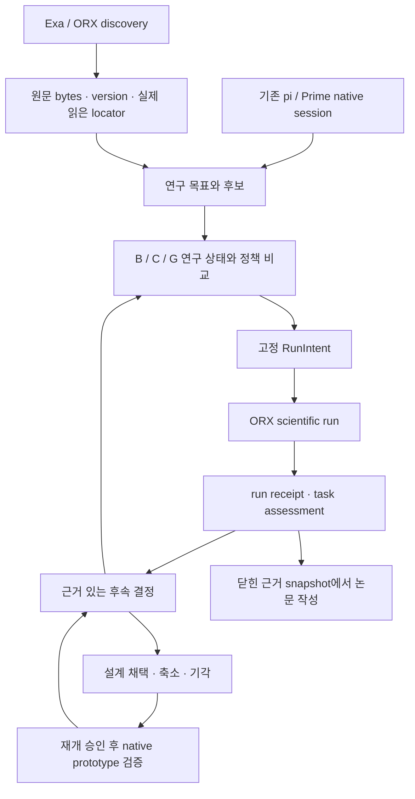

# 논문 연구에서 ARGO prototype으로 이어지는 설계 crosswalk

상태: **INTERNAL_DESIGN_CROSSWALK_NOT_IMPLEMENTATION_OR_EFFICACY** · 2026-09-08

논문에서 비교한 연구설계가 ARGO prototype의 구성·연결·동작 선택을 결정하도록 일곱 벤치마킹 재료를 현재 native owner와 비교실험에 연결한다.

이 문서는 내부 설계 연결표다. 현재 연구 프로그램과 owner/port 계약을 이어받으며 새 native 구현이나 효능 결과를 선언하지 않는다. 논문에는 검토한 학술 기제와 실제 실험만 옮긴다. 사용자 최신 설명은 논문→설계 선택→prototype의 연결 목적을 보강하며 기존 native construction pause를 해제하지 않는다.

## 현재 확인한 것

- 확인한 checkout: `orx/integrate-harness-evaluation-counterevidence-and` / `ea45dacde9b151c023ea8d65189e4dc1871d79c0`. migration-state에 기록된 upstream base는 `81ae3cb34d27d38ee37f9e205a1e73694993b344`이며 현재 HEAD와 구분한다.
- pi/Prime의 tool hook, session/RLM owner, REPL 실행·snapshot, harness version/refinement/rollback은 현재 source에 존재한다. 이 관찰은 실행 검증이나 과학적 성능 증거가 아니다.
- native source의 `ResearchState`, `DiscoveryPort`, `SourceEvidenceService`, `ResearchRunAdapter`, `ResearchEventStore` 이름 검색에서는 구현을 찾지 못했다. owner-port 문서도 DESIGN_ONLY라고 명시한다. 이 검색으로 다른 이름의 모든 구현 부재까지 증명하지 않는다.
- task-specific house-price ORX bridge source는 존재한다. native ARGO importer와 구분하며 이 lane에서는 과학 실행·장치 인증을 하지 않았다.
- 이번 ORX keyword discovery는 exit 0 receipt가 있다. Exa는 initialize HTTP 403으로 검색에 도달하지 못했다. provider 장애는 별도 기록하고 사용 성공으로 보고하지 않는다.

## 연결 흐름

공통 실행기·검색 접근·원문·평가·예산을 맞추고 연구 정책의 차이를 비교한다. graph가 외부 run의 상태나 native worker lifecycle을 다시 소유하지 않는다.

## 일곱 재료

### 1. pi

**학술 추상화:** 도구를 사용하는 LLM의 상태 전이, 관측-행동 loop, bounded continuation 및 tool admission

**현재 상태:** `INHERITED_SOURCE_PRESENT_FIXED_SUBSTRATE`

- `packages/agent/src/agent.ts:97-117` — AgentOptions supplies transformContext, before/afterToolCall, stop, continuation and tool execution hooks; source interface exists, effect unmeasured.
- `packages/coding-agent/src/core/agent-session-services.ts:220-260` — Session creation injects existing services, tools, session manager, RLM and goals.

**연결/owner:** 기존 Agent core의 hook/확장 계약을 통해 연구 정책의 허용된 action과 관측을 전달한다. Prime native session은 이 core를 소유한다. ARGO를 별도 wrapper로 구성하지 않는다.

입력: 동일 model/tool set, 허용 action, 현재 관측 → 출력: tool result, agent event, continuation/stop

**실패 시 대안:** 첫 비교에서는 기존 기본 context/tool loop를 고정한다. hook이 특정 정책을 표현하지 못하면 그것을 장치 결함으로 기록하고 별도 실험 어댑터의 범위를 검토한다.

**비교 실험:** B/C/G 간 core/model/tool/stop budget 동일성 확인. 핵심 효능 contrast가 아니라 장치 비교 가능성 점검이며, 저수준 실행 hook 자체의 우월성은 주장하지 않는다.

**prototype acceptance:** 선택된 research action이 동일 native tool event로 실행되고 취소/stop 및 사용량 경계가 유지됨을 실제 receipt로 확인.

**literature_needed:** 도구 사용·행동/관측 loop·programmatic context의 출판된 원문, 대안 loop와 bounded stopping 적용 범위. pi 이름 자체를 과학적 efficacy 근거로 사용하지 않음.

### 2. Prime Agent

**학술 추상화:** 장기 실행 agent의 persistent execution context, 계층적 작업 위임, 재시작 및 실행 상태 복구

**현재 상태:** `INHERITED_SOURCE_PRESENT_FIXED_SUBSTRATE`

- `packages/coding-agent/src/core/agent-session-runtime.ts:69-91` — AgentSessionRuntime owns the session, services, subagent host and runtime map.
- `packages/coding-agent/src/core/agent-session-runtime.ts:201-215` — Shutdown awaits session disposal/final kernel snapshot and hosted-subagent disposal; binds one native runtime host.
- `packages/coding-agent/src/core/kernel/repl-manager.ts:719-739` — REPL execute serializes work and schedules snapshot after successful execution.
- `packages/coding-agent/src/core/rlm-runtime.ts:164-178` — Typed rlm.run kernel host handler validates prompt and forwards request.
- `packages/coding-agent/src/core/rlm-runtime.ts:241-255` — SubagentRuntimeHost defines create, completion/release and delete ownership.

**연결/owner:** daemon→resident worker→AgentSessionRuntime→REPL/RLM을 유지하고 연구 상태를 session artifact namespace에 연결한다. graph executor가 worker를 다시 만들거나 ORX run의 상태를 대신 결정하지 않는다.

입력: goal/session ID, messages, tool calls, artifact references → 출력: transcript, worker/session state, available snapshot, tool observations

**실패 시 대안:** snapshot의 비직렬화 상태는 원래 관측·artifact로 다시 도출한다. source에 snapshot이 있다고 모든 상태가 복구된다고 가정하지 않는다. 불확실한 scientific launch는 반복하지 않고 ORX와 대조한다.

**비교 실험:** 같은 연구 정책과 데이터로 정상 실행/중단/재개 fixture를 비교하고 누락 state, 중복 scientific launch, recovery latency를 측정. 본 효능 평가에서는 substrate를 조건 간 고정.

**prototype acceptance:** fresh session이 선택된 후보·근거·최신 run identity와 다음 행동을 재구성하고 진행 중 실행을 중복 생성하지 않는 한 번의 end-to-end 시연.

**literature_needed:** persistent REPL, recursive language-model execution 및 long-horizon recovery의 실제 원문과 한계. inherited 구현은 연구 novelty 또는 안정성 실험 결과가 아님.

### 3. OpenResearch CLI

**학술 추상화:** 문헌 후보 검색과 고정 실험의 실행 식별·provenance를 제공하는 외부 연구 서비스

**현재 상태:** `LIVE_DISCOVERY_RECEIPT_PRESENT_EXTERNAL_RUN_INTEGRATION_TASK_SPECIFIC`

- `.planning/2026-09-08-autonomous-thesis-research/orx/initial-keyword-receipt.json:2-16` — Same-turn keyword discovery command returned exit 0 and hashed nonempty output; it proves retrieval only.
- `experiments/argo_workflow_followup/public_ml_apparatus/house_price_runtime/bridge.py:728-799` — Task-specific FixedNativePort contains ORX experiment creation and run launch code; source existence only, no launch or certification by this audit.
- `experiments/argo_workflow_followup/public_ml_apparatus/house_price_runtime/bridge.py:984-989` — Task-specific adapter queries native ORX status/runs rather than deriving terminal state from the research graph.
- `paper/research/five-reviewer-design-review-20260907/integration/owner-port-contracts.json:101-139` — Scientific-run authority belongs to ORX; future ResearchRunAdapter owns identity translation only.
- `paper/research/five-reviewer-design-review-20260907/integration/owner-port-contracts.json:249-251` — Remote idempotency remains unverified; uncertainty must not trigger a duplicate launch.

**연결/owner:** Discovery 결과는 공통 source evidence 경로로 연결한다. ScientificRunIntent→고정 ORX project/experiment→외부 run ID/terminal receipt→ResearchRunAdapter→Result 순서로 연결한다. native product importer는 아직 설계 단계이며 task apparatus와 구분한다.

입력: query 또는 frozen intent/code/command/environment/resource identity → 출력: source candidate 또는 authoritative run ID/status/artifact receipt

**실패 시 대안:** 문헌은 keyword/OpenAlex/직접 원문으로 계속 수집한다. 실행 interface 불확실성은 UNKNOWN을 보존하고 authoritative run record로 reconciliation한다. 별도 임시 runner로 scientific authority를 우회하지 않는다.

**비교 실험:** run reply 유실, duplicate receipt, wrong identity, stale protocol의 identity translation fixture와 task-specific 실제 terminal receipt를 비교. discovery 성공과 scientific-run certification을 분리한다.

**prototype acceptance:** 최소 한 scientific run의 intent→native run ID→artifact→결과→다음 설계 경로를 재검증할 수 있고 상태 불명 때 중복 실행이 발생하지 않음.

**literature_needed:** 재현 가능한 계산실험·실행 provenance·실험 계보의 출판 원문. ORX API/CLI 문서는 interface 증거로 별도 보존하고 과학적 superiority 근거로 사용하지 않음.

### 4. Exa plugin

**학술 추상화:** 공개 source 후보의 의미 기반 retrieval을 제공하는 교체 가능한 discovery adapter

**현재 상태:** `GENERIC_MCP_NATIVE_SUPPORT_PRESENT_EXA_SESSION_BLOCKED`

- `packages/coding-agent/src/core/agent-session-services.ts:149-156` — Native services create McpManager and register user providers; this is generic capability, not proof of configured Exa.
- `.planning/2026-09-08-autonomous-thesis-research/exa/receipt.json:22-44` — Same-turn receipt reports HTTP 403 initialization; tools/list and search were not attempted, no Exa scholarly results obtained.
- `paper/research/five-reviewer-design-review-20260907/integration/owner-port-contracts.json:26-59` — DiscoveryPort emits candidates; SourceEvidenceService is a separate proposed step for bytes/version/actual read locator.

**연결/owner:** Exa→DiscoveredSourceCandidate→원문 수집/판독→SourceEvidence→연구 결정. 검색 snippet이 claim이나 paper snapshot을 직접 생성하지 않는다.

입력: query, 허용 corpus/domain, provider와 retrieval budget → 출력: URL, metadata, retrieval timestamp, provider; 실제 원문 근거는 후속 단계

**실패 시 대안:** 현재는 root가 성공한 ORX keyword/embedding/OpenAlex와 직접 원문을 사용한다. Exa 차단은 provider 결함으로 기록하며 금지된 재시도·우회·무단 설정 변경을 하지 않는다.

**비교 실험:** retrieval이 실제 병목일 때만 frozen corpus/query budget으로 semantic vs keyword/hybrid를 screening. relevance, 필요한 원문 도달률, 중복률, unsupported citation과 비용을 각각 측정하고 전체 agent 효과와 혼동하지 않는다.

**prototype acceptance:** 선택 provider에서 원문에 도달하고 source version/read locator가 남으며 provider 실패에도 현재 연구 상태와 결과가 손상되지 않음. Exa 사용 성공은 현재 미달.

**literature_needed:** scientific retrieval/RAG의 다단계 평가와 실패 분석 원문. vendor 검색 기능을 논문의 검증된 방법 효과로 전이하지 않음.

### 5. context graph

**학술 추상화:** 주장·근거·가설·실험·결과·후속 결정의 typed/versioned dependency representation

**현재 상태:** `RESEARCH_ARTIFACT_AND_VALIDATOR_PRESENT_NATIVE_RESEARCH_STATE_NOT_IMPLEMENTED`

- `paper/research/material-mechanism-evidence-map.md:26-26` — Current active design distinguishes versioned dependency control candidate from flat ledger/result tree and passive audit.
- `experiments/argo_workflow_followup/validate_graph_integrity.py:2-25` — Python research validator checks schema, node/edge identities and projection hashes; not a native TypeScript controller or task efficacy evidence.
- `paper/research/five-reviewer-design-review-20260907/integration/owner-port-contracts.json:62-99` — Audit event projection and B/C/G policy owners remain JSON fixture / candidate design states.

**연결/owner:** 공통 source/run facts를 ResearchEventStore에 남기고 native ResearchState projection에서 evidence dependency와 active revision을 도출한다. 공통 neutral audit graph와 G의 agent-visible graph를 분리한다.

입력: source evidence, decision revision, protocol/run/result receipt, retraction/reopen observation → 출력: active revision, dependency query, affected set, continuation capsule

**실패 시 대안:** C/B가 충분하면 graph를 research audit/export로 유지하고 agent-visible control은 compulsory ledger 또는 strong tree/notebook으로 축소한다.

**비교 실험:** B=강한 persistent source-backed tree/notebook, C=동일 tree+compulsory validity/preservation/capsule, G=동일 의무+graph-mediated dependency control. G-C는 graph-control package 증가분이고 순수 topology 효과가 아니다. 데이터·source access·실험 기회·model·tool·budget을 일치시킨다.

**prototype acceptance:** 관측 또는 source revision 하나가 관련 결정/다음 행동을 실제로 바꾸고 독립 근거의 유효성은 보존한다. graph 존재/노드 수/도구 호출 횟수만으로 통과하지 않음.

**literature_needed:** graph memory, evidence/claim graphs, long-horizon autonomous research의 원문 및 강한 tree/notebook comparator. memory QA의 이득을 과학 연구 성능으로 일반화하지 않음.

### 6. loop engineering

**학술 추상화:** 명시적인 관측·비판·설계 선택·실행·반증·중단 규칙으로 연구를 반복하고 연구 갱신과 engine 변경의 원인 계보를 분리하는 정책

**현재 상태:** `GENERIC_LOOP_AND_HARNESS_REFINE_INHERITED_SCIENTIFIC_POLICY_CANDIDATE`

- `packages/agent/src/agent.ts:105-109` — before/after tool, stop and continuation hooks support bounded generic loops.
- `packages/coding-agent/src/core/refinement/refinement.ts:716-799` — Inherited applyRefinementProposal validates edits, detects concurrent entry changes, increments versions and appends refinement history.
- `packages/coding-agent/src/core/refinement/refinement.ts:813-846` — Inherited rollbackProposal derives reverse edits from stored before/after state; no held-out scientific promotion proof.
- `paper/research/five-reviewer-design-review-20260907/integration/owner-port-contracts.json:177-208` — Research refinement is prospective; engine refinement deferred under native pause.

**연결/owner:** 연구 loop는 Decision→RunIntent→Observation→Successor를 ResearchState에서 관리한다. engine refine은 기존 Continual Harness의 별도 version/promotion/rollback 계보에 연결한다. 첫 과학 비교 동안 engine·prompt·scorer를 동결한다.

입력: admissible public observation, comparison criterion, opportunity/time budget → 출력: 유지/재검증/수정/기각 및 근거 있는 successor; 별도 engine patch proposal은 결과를 소급 변경하지 않음

**실패 시 대안:** 단순 반복이나 result-tree 정책이 충분하면 복잡한 critic/branching을 줄인다. negative 결과를 무조건 pivot으로 처리하지 않으며 실행 오류를 과학적 반증으로 승격하지 않는다.

**비교 실험:** C-B로 mandatory-process package의 증가분을 먼저 분리한다. graph와 무관한 critic/branching/engine adaptation은 필요가 측정된 뒤 별도 비교하며 첫 design에 모두 묶지 않는다.

**prototype acceptance:** 동일 기준에서 둘 이상의 실제 연구 후보를 비교하고 한 후보의 유지/접기 이유, 관측으로 선택한 다음 연구 행동을 보여준다. engine self-modification은 MVP 요구가 아님.

**literature_needed:** sequential research refinement, autonomous hypothesis testing, bounded critique, harness improvement 원문과 통계적 stopping 가정. 비판 반복 횟수만으로 순차 검정 보장을 주장하지 않음.

### 7. graph engineering

**학술 추상화:** 연구 dependency의 생성·갱신·범위별 무효화·재생·조회가 다음 행동에 미치는 영향을 결정하는 상태 유지/제어 기제

**현재 상태:** `DESIGN_CANDIDATES_AND_RESEARCH_VALIDATORS_ONLY_NO_SELECTED_NATIVE_BACKEND`

- `docs/argo/migration-plan.md:34-50` — M2/M3 propose append-only events, deterministic graph projection and typed dependency validation; migration plans are paused.
- `paper/research/material-mechanism-evidence-map.md:26-26` — LangGraph/SqliteSaver, native event+projection and SQLite event store are alternative implementation candidates.
- `paper/research/five-reviewer-design-review-20260907/integration/owner-port-contracts.json:62-79` — Audit history cannot be a second process supervisor or independent scientific run registry.

**연결/owner:** ResearchEventStore가 단일 연구 event history를 소유하고 선택된 projector/query policy가 active view를 만든다. LangGraph를 선택해도 research transition만 담당하며 daemon/worker/ORX lifecycle을 소유하지 않는다.

입력: versioned events, exact source/run IDs, edge semantics, retraction scope → 출력: deterministic active view, affected-set/reopen recommendations, replayable handoff

**실패 시 대안:** 관계 유지비·동기화 실패가 이득을 넘으면 append-only ledger+작은 projection/SQLite로 단순화한다. graph backend 교체의 효과와 research control package 효과를 따로 해석한다.

**비교 실험:** 본 비교는 G-C. backend 선택이 남으면 동일 event fixtures로 append-only projection vs SQLite vs proposed graph workflow의 replay parity, corrupt-event detection, scoped invalidation precision/recall, resume latency와 유지 비용을 비교. backend 3종을 모두 필수로 구현하지 않는다.

**prototype acceptance:** 동일 사건열의 fresh replay에서 같은 active revision과 다음 행동을 재구성하고 중복/역순/충돌 receipt를 탐지한다. 재계산된 graph 상태가 외부 run status를 덮어쓰지 않는다.

**literature_needed:** graph maintenance, provenance, dependency invalidation와 graph-based research orchestration의 실제 논문. 소프트웨어 checkpoint 기능 존재를 과학적 비교 결과나 독창성으로 표현하지 않음.

## 최소 설계 선택

| 조건 | 표현과 정책 | 해석 |
|---|---|---|
| B | strong persistent source-backed tree/notebook + advisory validity/preservation guidance | 강한 기본 비교군 |
| C | same representation + compulsory applicability/revalidation/preservation/capsule obligations | C−B: 의무화된 연구 절차의 효과 |
| G | same obligations + graph-mediated dependency traversal/scoped invalidation | G−C: graph-control package 증가분; 순수 topology 효과 아님 |

G가 사전 정의한 유용성을 보이면 native graph-control 후보로 채택한다. C 또는 B가 충분하면 더 단순한 제어를 쓰고 graph를 audit/export로 유지한다. 평가가 무효거나 불확실성이 크면 승자를 선언하지 않는다. 아직 empirical architecture winner는 없다.

Qualify the actual long-horizon task and common executable interface, then compare research-policy choices. Provider/backend/engine optimization is conditional on measured bottlenecks; no extra universal gate or all-features factorial is added.

## prototype에서 보여줄 증거

- Two real research candidates with a shared comparison criterion and retained rejection/retention reason
- At least one exact source-read path and one externally identified scientific run/result path
- One observation-driven successor decision with a fresh-context handoff
- Actual code/run/receipt showing the empirically selected policy in the native product
- Research outcome and product demonstration limits stated separately; benchmark superiority only under the measured protocol

이 항목은 기존 연구→제품 handoff를 구현 단위로 구체화한 것으로 새 승인 단계가 아니다. 정확한 해커톤 일정·재사용·제출 규칙은 root의 별도 공식-source 검토가 권위다.

## 조사 범위와 원문 결합

agent brief, migration state/plan, research decision/contribution contract, active material map, owner-port와 architecture-selection record를 확인했다. 작은 session service/RLM 파일은 전부 읽었고 큰 native source는 해당 owner·hook·snapshot·refinement 범위를 읽었다. lifecycle 전체를 실행 감사한 결과가 아니다. 논문 검색/원문 claim 검토는 root가 수행하며 이 문서는 literature_needed를 명시할 뿐 검증되지 않은 서지나 효능 주장을 만들지 않는다.

확인한 구현 source 및 receipt의 SHA-256과 locator 구조 검사는 JSON의 verification에 기록한다. 소유 파일은 이 Markdown과 동명 JSON 두 개다. 기존 manuscript/native source/config/instance에는 쓰지 않았다.
