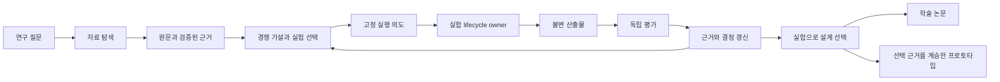

# 실험으로 설계를 선택하고 프로토타입으로 연결하는 연구

2026-09-08 · 내부 연구 산출물 · prospective design synthesis · 효능 결과·완성 원고·구현 완료 아님

## 1. 목적과 이번 결정

목표는 **장기 자율연구 에이전트의 역할·연결·제어 방식을 문헌과 실험으로 선택하고, 논문을 거쳐 ARGO 프로토타입으로 구현하는 것**이다. 사용자가 제공한 계획서 p.1의 자율 설계, 근거 기반 선택, 비교 추론, 문맥 그래프, 결과 반영과 일치한다. 원본 SHA-256은 `d2ab302410321cb43c499a681d289df72d86f889eaf4ca0b58b8e8ad804ea8f5`다. 원본의 예비실험 완료 문구 자체는 현재 유효 실험 완료 증거가 아니다.

공식 대회 안내는 연구 과정 전반에 에이전트를 활용하는 아이디어·프로토타입 경진대회이며 본행사는 2026-09-30–10-01로 게시돼 있다. 참가/제출 상태나 사전 코드 재사용 허용은 이 안내에서 추정하지 않는다. [공식 대회 안내](https://ai4scikorea.org/#competition)

이번 선택은 새 framework 목록 확대가 아니라 **기존 B/C/G 개발 비교를 유지하면서, 공통 대조군을 최신 원문에 비춰 약화 없이 구체화하는 것**이다. 연구 결과가 없는 지금 G나 통합 복잡 설계를 승자로 선택하지 않는다. P0의 동결된 실행 규약도 바꾸지 않는다.

## 2. 새 원문이 바꾸는 설계 판단

아래 세 원문은 OpenResearch CLI로 버전을 지정해 회수하고 전체 추출 본문을 읽었다. 원문·SHA·LF locator·읽기 범위는 이 디렉터리의 `source-evidence.json`과 `sources/`, 세부 검토는 `reviews/`에 보존한다. 모두 공개 preprint이며 동료심사 게재지는 이번에 확인하지 않았다. 출판된 학회논문으로 표기하지 않는다.

| 실제 읽은 원문 | 확인된 기제 | 이 연구에서의 결정 |
|---|---|---|
| [Iris: Beyond Solution-Centric Search](https://www.alphaxiv.org/abs/2608.02143) | 범위를 가진 주장, 찬성/반증 근거, 유효·한정·무효 상태, 진단과 후보 수정, 근거의 세부 수준별 접근 | scoped claim·무효화 자체를 신규성으로 삼지 않는다. C와 G에 같은 진단·근거 접근 권리를 주고 graph 제어의 추가 가치만 질문한다. |
| [ScienceFlow](https://www.alphaxiv.org/abs/2608.14354) | 복구 가능한 실행 상태, 현재/보관 상태의 재선택, 예산과 실행 진척에 따른 자원 제어 | graph 조건에만 복구·보관 자료를 주지 않는다. 복구 성공과 연구 성과를 나눠 평가한다. |
| [Efficiency Matters in Autonomous Research](https://www.alphaxiv.org/abs/2607.24647) | 탐색 방식별 예산 효율 비교와 hill-climbing chain들에 대한 적응적 예산 배분 | 탐색 스케줄러를 graph 처리에 몰래 섞지 않는다. 최종 성과를 primary로 유지하고 dev 진척·비용 곡선은 보조로 둔다. |

이들은 서로 다른 설계 대안을 제공한다. Iris는 이해·근거 수정, ScienceFlow는 실행 상태·연속성, Efficiency Matters는 탐색 예산 배분을 중심에 둔다. 모두 한 조건에 추가하면 원인이 무엇인지 분리할 수 없다. 이 구분은 원문을 종합한 우리의 설계 추론이다.

비교 한계도 보존한다. Iris의 정보관리 제거는 장기 지식과 근거 접근을 함께 제거하며, main leaderboard와 cross-domain 결과는 완전히 같은 모델·자원의 직접 비교가 아니다. ScienceFlow의 주요 순위 비교도 hardware/concurrency가 다르고 일부 ablation은 누적 first-medal 기준이다. Efficiency Matters의 archive-best AUC는 evaluation 수를 축으로 하므로 hidden final artifact 성과나 전체 토큰·GPU 비용과 같지 않다. 이 수치를 로컬 SOTA, 효과크기, power prior로 사용하지 않는다. [Iris](https://www.alphaxiv.org/abs/2608.02143), [ScienceFlow](https://www.alphaxiv.org/abs/2608.14354), [Efficiency Matters](https://www.alphaxiv.org/abs/2607.24647)

## 3. 일곱 벤치마킹 대상의 연결

다음 표는 내부 구현 설계다. 제안된 서비스명이 현재 native 구현을 뜻하지 않는다. 정확한 코드 owner와 구현/제안 구분은 `prototype-crosswalk.md`에 있다.

| 대상 | 맡길 역할 | 연결 규칙 | 실험에서 다룰 부분 |
|---|---|---|---|
| pi | 모델 호출·도구·세션의 기본 substrate | 상속한 실제 코드와 revision을 고정한다. 별도 제품을 나란히 감싼다고 가정하지 않는다. | 공통 실행 기반; 필요한 경우 별도 runtime portability 측정 |
| Prime Agent | daemon·worker·REPL·RLM·복구·harness state | process/session lifecycle은 기존 owner가 유지한다. | 모든 조건에 같은 기본 복구와 계산 권리 |
| OpenResearch CLI | 공개 학술 검색 및 scientific run identity/lifecycle | discovery와 execution 역할을 구분한다. run receipt를 가져오며 graph가 두 번째 실행 registry가 되지 않는다. | run 성공·UNKNOWN·실패와 비용 회계; graph 효능과 분리 |
| Exa | 웹·코드·출처 후보 discovery | 검색 결과는 후보로 받고 원문 검증을 거쳐 근거로 승격한다. | 공급자 접근·자료·검색 기회를 공통화; 장애는 retrieval 실패로 기록 |
| context graph | 문헌→주장→가설→결정→실험→결과의 연구 계보 | 공통 audit graph와 G의 agent-visible 제어 graph를 구분한다. | 기록의 완전성과 실제 결정 기여를 구분 |
| loop engineering | 질문·진단·실험·해석·반증·다음 행동·중단 | 새 결과가 바꾸는 결정과 중단 사유를 명시한다. | advisory B 대 compulsory C, 연구-loop와 engine-refine 분리 |
| graph engineering | 관계 생성·버전·범위·충돌·재검증·재개 | agent가 관계를 만들며 추출 오류·갱신 비용을 부담한다. | 동일 의무·자료를 가진 C 대 graph-mediated G |

이 그림은 연구 흐름의 제안이다. 실제 graph가 native 실행을 제어했다는 증거가 아니다. 논문과 prototype은 같은 선택 근거를 소비하지만 공개 콘텐츠의 역할은 다르다.

## 4. 비교 실험이 선택해야 할 것

| 비교 | 같은 조건 | 의도한 차이 | 해석과 prototype 반영 |
|---|---|---|---|
| C−B | 강한 source-backed tree, 진단·원문·동일 사실과 기회, 모델·예산·복구 | advisory 점검과 compulsory applicability/revalidation/preservation | 의무 절차의 성과·비용 효과. 불필요한 절차는 축소한다. |
| G−C | 동일 의무와 집행 강도, 동일 원자료·계산 권리 | graph-mediated traversal·범위 무효화·continuation | graph-control package의 증분. 순수 topology 효과라고 주장하지 않는다. |
| 개발에서 선택된 설계 대 최강 신뢰 대조군 | 별도 task/source families, frozen selection·budget·score | 사전 동결한 하나의 primary contrast | unseen programme에서도 실용적 이점이 유지되는지 보고 최종 구성을 선택한다. |

강한 대조군은 과거 실패, 원문 복구, 범위가 있는 사실을 사용할 수 있어야 한다. 비graph 조건이 자체 의존성 검사를 구현하는 것도 금지하지 않는다. 실제 처리 차이는 사용 로그로 확인한다. 최근 원문에서 본 loop·scheduler를 채택할 경우 모든 조건의 공통 요소로 고정하거나 별도 후속 실험으로 취급한다. 동결 후 몰래 추가하지 않는다.

주 결과는 전체 예산 내에서 agent가 선택·lock한 **단일 최종 artifact의 독립 hidden 성과**다. dev 진척 곡선, 의존성 오류, 부적절한 재사용, 재개 후 결정 보존, 실패/UNKNOWN, 총비용·사람 개입은 사전에 정의한 보조 지표다. primary가 null이라고 보조 지표를 주 결과로 바꾸지 않는다. 탐색 도중 hidden 후보들을 추가 평가해 archive-best를 고르지 않는다.

P1에서 사용할 최소 유용 효과 또는 outcome-independent 도출 규칙은 arm-labelled 효과를 보기 전에 정한다. 같은 task의 seed·후보·context는 독립 programme 수가 아니다. paired programme 추정과 불확실성을 보고하며, 효과가 유의하지 않다는 이유로 동등하다고 결론 내리지 않는다. 구체 값과 표본 수는 이번 문헌 수치로 만들어내지 않았다.

## 5. 현재 실제 진행 지점

최신 `p0-observability-disposition-v1.json`과 protocol hash를 직접 확인했다. House Price `HP-P0-A2-v1`은 C0 feasibility다. B/C/G 비교가 아니다. A/A2 승인, 분할 준비·독립 확인, 고정 규약과 합성 통합 검증은 이미 있다. 2 contexts·dev 3회·final refit 1회·R1 요청 최대 5회·합계 120,000 tokens가 규약에 들어 있다. 모든 자원 항목의 엄격한 실행 중 상한 인증을 뜻하지 않는다.

기록된 실제 과학 programme·run·hidden score·B/C/G 배정은 각각 0이다. 따라서 MAE, 성공률, graph의 유익/무익, 최종 설계 승자는 아직 미관측이다. 기록상 남은 항목은 FG-001 실행 방식, CUSTODY-001 실제 process-capture chain, ACCESS-001 task-local OAuth다. 이들은 이전 실행 환경에서 남은 불확실성이며 이번 세션에서 새로 재현한 보편적 불가능성이 아니다. 기존 승인과 준비를 다시 요청하거나 처음부터 반복하지 않는다. [최신 관측 기록](../public-ml-programme-qualification/house-price-p0/p0-observability-disposition-v1.json)

## 6. 실험 이후 프로토타입으로 넘길 산출물

설계 선택 기록은 채택·기각한 기제, 적용 범위, 실패·비용, 대응 코드 owner를 함께 넘긴다. 프로토타입은 선택된 설계로 하나의 연구 과제에서 원문→가설→실험→독립 평가→방향 갱신을 실제 수행하고, 중단·재개 뒤 같은 근거와 artifact를 복구하는 경로를 보여준다. UI는 측정 결과·미확인·실행 실패를 구분해 표시한다. 이는 앞으로 검증할 인수 기준이며 완료 주장이나 추가 실행 승인이 아니다.

G의 추가 가치가 지지되지 않으면 C/B 기반의 단순한 프로토타입도 올바른 결과다. 결과가 불확실하면 실제 측정된 feasibility와 한계만 넘기며 SOTA를 선언하지 않는다. 논문은 이 설계 선택을 학술적으로 설명하고, 프로토타입은 선택된 동작을 구현·시연한다.

## 7. 이번 회차의 범위

ORX 검색 3회로 45개 후보 레코드를 얻어 10개를 선정하고, 5개 원문을 회수했다. 이 중 새로 깊게 검토한 3개만 위 상세 기제 판단에 사용한다. 나머지 2개는 회수 자료이며 이번 완독으로 표시하지 않는다. 기존 foundational corpus는 별도 locator 탐색 자료로 보존했으며 이번 완독 수에 더하지 않는다.

Exa는 세션 도구에 없었고 공식 공개 MCP 초기화가 HTTP 403/Cloudflare 1010으로 차단됐다. 검색 성공으로 기록하지 않았다. OpenResearch 원문 회수는 성공했다. 현재 정본 QMD·과거 export·동결 실험·native runtime은 변경하지 않았으며 실제 모델 학습/평가도 시작하지 않았다.

다음 연구는 준비된 C0의 기존 실행 불확실성을 정확히 해결하는 작업과, 본 원문 비교를 반영한 P1 task-bound B/C/G 명세를 이어간다. 새 일반 검토 체계를 반복해서 늘리는 단계가 아니다.
