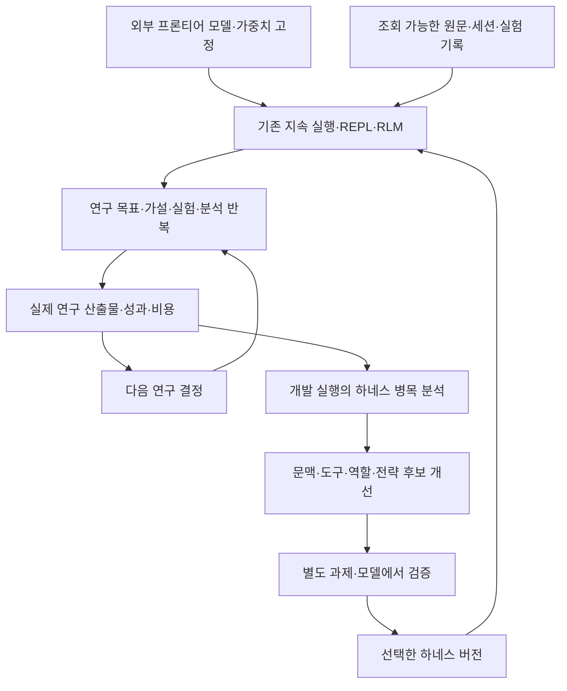

# 프론티어 모델이 지속적으로 연구하도록 하는 하네스

2026-09-08 · 사용자 지정 다섯 연구를 중심으로 정렬한 현재 연구 방향

## 무엇을 연구하려는가

**프론티어 모델이 긴 연구 과정을 스스로 운영하고, 검증 가능한 결과를 만들며, 그 수행 방식을 개선할 수 있게 하는 하네스·방법론**이 연구 대상이다. 모델 가중치는 외부 기반으로 고정한다. 문헌 조사·가설·실험·분석을 수행하는 도구와 실행 환경, 문맥 관리, 협업, 지속 개선을 함께 다룬다.

이전 설계를 경험 재사용이나 skill 전이만으로 한정한 것은 사용자가 지정한 연구 범위를 충분히 반영하지 못했다. 경험 재사용·graph 관리·모델 간 전이는 이 전체 하네스 안에서 검증할 수 있는 하위 기제다. B/C/G 그래프 비교를 다시 주제로 삼지도 않는다.

직관적인 주 질문은 **“같은 프론티어 모델에 어떤 실행·문맥·연구 운영 구조를 제공해야, 긴 연구 과정에서도 멈추거나 같은 시도를 반복하는 데 그치지 않고 실제 성과를 계속 만들 수 있는가?”**다.

예를 들어 “이 추천 모델의 품질을 개선하라”는 목표를 맡기면 자료를 조사하고, 가설을 세우고, 코드를 고치고, 실험을 실행하고, 결과를 해석해 다음 방향을 선택해야 한다. 연구 결과의 점수와 비용, 선택한 이유, 실패와 후속 변경을 실제 산출물로 확인할 수 있어야 한다. 이는 시연 목표이며 지금 실행·성공했다는 뜻은 아니다.

검증된 부정적 결과나 잘못된 방향을 접는 판단도 연구 진척이다. 매 회차 새 기능이나 점수 상승을 강제하지 않는다. 다만 특정 ML 과제에 정한 주 성능 지표를 사후에 다른 진척 지표로 바꾸지는 않는다.

## 사용자가 지정한 다섯 기준 연구

| 연구 | 설계의 중심 | 우리 연구에서의 역할 | 주의할 경계 |
|---|---|---|---|
| [Prime Agent](https://www.alphaxiv.org/abs/2608.23552) | 지속 실행, 외부 상태, REPL/RLM, 위임·통신, model-led 전략 | 기반 실행 기질과 계산·정보 접근의 표현력 | 더 많은 도구 사용·외부 실험이 최종 성과 향상을 뜻하지 않는다. 원문의 nanoGPT 비교는 최종 차이가 실험 잡음 대비 작다고 보고한다. |
| [Harness-of-Harness](https://www.alphaxiv.org/abs/2609.01481) | 계획·실행·평가·재계획을 반복하며 프로젝트를 발전시키는 상위 조직 방식 | 장기 목표를 구체 산출물과 반복 연구 단계로 이어가는 운영 구조 | 모델·기본 하네스·역할·runtime 정책은 run 안에서 고정된다. 프로젝트 산출물 개선을 하네스 코드의 자기 개선으로 부르지 않는다. |
| [Scroll](https://www.alphaxiv.org/abs/2608.21690) | 세션 기록을 조회 가능한 실행 환경으로 두는 프로그램적 문맥 관리 | 긴 원문·로그·과거 실험에서 지금 필요한 정보에 접근하는 방식 | 원문 기록 보존과 모델이 필요한 근거를 모두 찾아 이해하는 것은 다르다. |
| [HarnessDev](https://www.alphaxiv.org/abs/2609.01437) | 하네스 생성·수정 능력과 그 downstream 성능·비용 평가 | 하네스 자체를 개선할 때 사용할 실험·일반화 관점 | 하네스 개선이 항상 유효하거나 다른 모델에 그대로 전이한다고 가정하지 않는다. |
| [RecEvolve](https://www.alphaxiv.org/abs/2609.01622) | 아이디어·비판·구현·학습·평가·다음 실험의 실제 ML 연구 루프 | 장기 자율연구가 만들어야 할 업무와 산출물의 구체 예 | 개선되는 대상은 추천 모델과 연구 결과다. 프론티어 LLM 학습이 아니다. 산업용 비공개 데이터·TPU 결과는 우리의 직접 성과가 아니다. |

다섯 연구는 역할이 다른 참고 축이다. 이들을 모두 설치하거나 이름을 합치는 것이 방법론 또는 신규성의 증거가 되지 않는다. 사용한 구체 원문 버전·읽기 범위·해시는 `source-evidence.json`에, 상세 검토는 `source-reviews/`에 보존한다. 공개 기술보고서/preprint의 확인 범위를 넘어 게재 상태를 단정하지 않는다.

## 통합 구조: 서로 다른 두 개선 루프

**연구 루프**는 주어진 연구 목표 안에서 가설·실험·모델 코드·분석과 결과물을 개선한다. HoH의 장기 프로젝트 운영과 RecEvolve의 과학 실험 순환이 직접적인 참고다.

**하네스 개선 루프**는 개발용 연구 실행에서 나타난 병목을 분석해 문맥 구성, 역할 배정, 도구 interface, 연구 지침 또는 전략의 후보를 수정한다. HarnessDev의 관점으로 새 과제와 다른 모델에서 검증한 뒤 선택한다. 하네스 변경을 동결한 실험에 소급 적용하거나, 현재 과제의 점수만 보고 일반적인 개선이라고 하지 않는다.

두 루프 아래에는 Prime 계열의 하나의 실행 owner가 있고, Scroll에서 참고한 프로그램적 문맥 접근을 그 위에 연결한다. 별도의 REPL·세션 supervisor·scientific run registry를 각각 중복 구축하지 않는다. ARGO는 기존 Prime fork를 발전시키는 제품이며, HoH의 wrapper 구현을 그대로 복제하는 별도 제품으로 정의하지 않는다.

그림은 제안된 연구 구조다. 두 개선 과정과 평가 시점을 구분하는 것이 중요하며, 하네스의 실제 구현·배포를 완료했다는 뜻은 아니다.

## 기술들의 연결과 소유권

- **pi/Prime:** 모델 호출·도구·resident session·REPL/RLM·재개·메시지 전달의 기반을 유지한다. 연구 전략 전체를 고정 workflow로만 제한할지, 모델이 구성하도록 할지는 설계 대안이다.
- **Scroll에서 차용할 문맥 방식:** 하나의 원본 session/event store에 조회·부분 노출·scope 전환을 연결한다. 모든 기록이 디스크에 있다는 이유만으로 필요한 근거가 active context에 들어왔다고 판단하지 않는다.
- **연구 controller:** 현재 가설, 실행 중 실험, 결과 해석, 다음 결정과 연구 종료를 연결한다. developer/tester 등 software role을 과학적 가설/실험/분석 역할로 옮길 때는 그 효용을 따로 측정한다.
- **Exa·OpenResearch 문헌 도구:** 후보 자료를 찾고 선택 원문을 읽는다. 검색 요약을 실험 근거로 바로 승격하지 않는다.
- **OpenResearch scientific run:** 과학 실험의 ID·상태·로그·산출물을 소유한다. 세션 owner나 research graph가 외부 run 상태를 임의로 확정하지 않는다.
- **context graph:** source·가설·결정·실험·결과·하네스 버전의 연구 계보를 연결한다. 유용한 유지·조회 방식은 비교할 수 있지만 graph 그 자체가 주 결과는 아니다.

## 무엇을 실험으로 밝혀야 하는가

먼저 **통합 연구 하네스가 같은 모델의 강한 기존 실행 방식보다 장기 연구 결과를 개선하는지**를 본다. 연구 목표·자료·원문 권리·실험 기회·전체 자원 한도를 맞추고, 최종 산출물의 독립 성과·실패·비용을 함께 평가한다. 단순한 프롬프트나 무기억 모델만 대조군으로 두지 않는다.

그다음 실제 차이가 관측된 지점에서 문맥 관리, 연구 loop 운영, 또는 하네스 개선의 기여를 분리한다. 처음부터 모든 요소의 전체요인 실험이나 기존 B/C/G 의무 비교로 돌아가지 않는다. 연구 조직 방식의 효과를 보고하면서 underlying retrieval·도구·계산량 차이를 숨기지 않는다.

하네스 개선의 일반화는 개발용 실행에서 만든 후보를 고정하고 별도 과제·모델에서 확인한다. 모델별 하네스 차이를 계산하여 더 강한 모델을 쓴 효과와 구분한다. 새 모델이 나올수록 반드시 성과가 단조 증가한다거나 모든 미래 모델에 보편적이라는 주장은 하지 않는다.

| 평가 관점 | 관측할 실제 결과 |
|---|---|
| 연구 성과 | 사전에 정한 과제의 독립 최종 성능, 검증된 산출물 |
| 지속적인 진척 | 예산·시간에 따른 개발 진척, 정체 후 선택 변경, 불필요한 반복과 합리적인 재검증의 구분 |
| 문맥 활용 | 필요한 과거 원문·실험을 실제 결정에 사용했는지, 검색·문맥 전환의 실패와 비용 |
| 하네스 개선 | 개선 후보의 새 과제 성과·퇴행·모델 의존성, 생성/검증을 포함한 비용 |
| 자율성·효율 | 사람 개입, 실패·재개·미확정 실행, root와 모든 하위 작업의 전체 자원 |

활동량·문서 수·skill 수·graph 크기는 연구 진척의 대리 결과로 한정한다. 특히 Prime의 out-of-loop 행동 차이나 HoH의 장기 프로젝트 사례를 독립적인 과학 성과의 보장으로 사용하지 않는다.

## 논문과 해커톤의 연결

논문은 **프론티어 모델의 지속적 자율연구를 가능하게 하는 하네스 구조·운영 방법과 그 실험적 평가**를 다룬다. 정확한 학술 서지는 유지하되 ARGO 내부 운영명·도구 홍보·해커톤 계획을 학술 기여로 옮기지 않는다.

ARGO는 선택된 설계로 목표 하나를 받아 자료 탐색부터 실험·분석·다음 결정까지 실제 수행하는 prototype이다. 단순한 채팅 창·검색 요약·graph 시각화로 완료를 주장하지 않는다. 사용자가 연구 목표를 맡긴 뒤 실제 산출물과 진행 이유, 비용을 확인하는 장면이 중심이다.

현재 사용자 발언은 이 연구 계열을 분명하게 지정한다. 직전 경험 전이 연구와 48회 파일럿은 가능한 하위 실험으로 보존하며, 전체 연구를 대표하는 확정 설계로 강제하지 않는다. 정확한 주 과제·비교 조건·실행 예산은 이 다섯 축의 설계 대안을 구체화한 뒤 고정한다. 모델·native 코드·실험을 이번에 실행하거나 수정한 것은 아니며, 기존 native construction pause와 동결 P0 원본은 유지한다.
