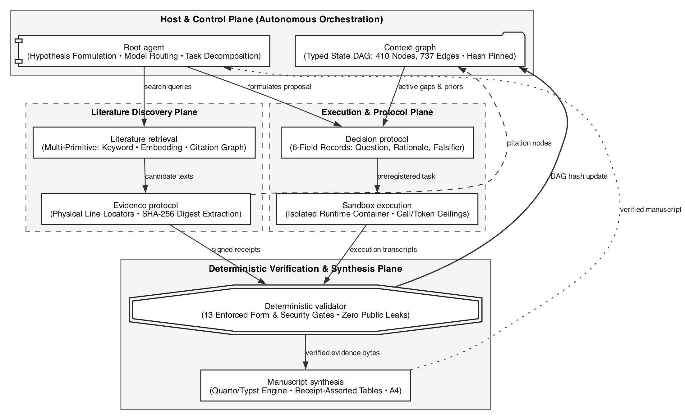

# Ⅰ. Introduction

## 1. 연구 배경

능력 있는 언어모델 하나만으로는 장기 연구 에이전트가 되지 않는다. 지속되는 문맥, 외부 도구에
근거한 행동, 검색, 조율, 이전 시도로부터의 학습이 함께 필요하다. 이 구성 요소들을 묶은 것을
하네스(harness)라 부르며, 본 연구는 그 하네스를 설계하고 평가한다.

## 2. 이 논문이 먼저 세우는 원칙

**측정 도구의 인정 가능성(admissibility)은 효과 추정에 선행한다.** 어떤 처치가 결과를 바꾸었다고
말하려면, 그 결과를 재는 도구가 먼저 신뢰할 수 있어야 한다. 이 원칙은 선언에 그치지 않고 본 연구의
모든 결정을 지배했으며, 아래 세 가지는 모두 그 원칙의 직접적 결과다.

첫째, **채점기를 반증했다.** 단서 기반 검색이 후보 구절을 찾지 못하면 파이프라인은 모델을 부르지도
않고 부정 판정을 내렸다. 전체 산출물을 다시 판정하자 파이프라인 부정 판정 18건 중 7건이 뒤집혔다.
둘째, **교정 세트의 크기와 성격을 그대로 보고했다.** 셋째, **판정 채점을 스스로 불인정으로 선언했다.**

이 순서를 뒤집으면 도구가 만들어 낸 차이를 처치의 효과로 보고하게 된다. 본 연구가 효과 추정치를
제시하지 않는 이유도 여기에 있다.

## 3. 기여

본 논문의 기여는 성능 수치가 아니라 **계측 규율과 그것이 드러낸 실패들**이다. @fig-arch 는 전체
시스템 구성을, @tbl-variance 는 판정 endpoint의 분산 성분을 보인다.

{#fig-arch width=100%}

```{python}
#| label: tbl-variance
#| tbl-cap: "판정 endpoint의 분산 성분과 dependability"
#| echo: false
import json, pathlib
from IPython.display import Markdown
r = json.loads(pathlib.Path("../experiments/generalizability-study-receipt.json").read_text())
rows = []
for task, blk in r["per_task"].items():
    s = blk["share_of_clamped_total"]
    rows.append((task.split("-")[0], s["condition"], s["element"], s["residual"],
                 blk["d_study_as_run"]["dependability_index"]))
assert len(rows) == 2, "receipt must carry exactly two tasks"
for _, cond, _, _, _ in rows:
    assert cond < 0.05, "condition share must match the recorded near-zero value"
head = "| 과제 | 조건 성분 | 요소 성분 | 잔차 성분 | dependability |\n|---|---:|---:|---:|---:|"
body = "\n".join(f"| {t} | {c:.3f} | {e:.3f} | {rs:.3f} | {d:.3f} |" for t, c, e, rs, d in rows)
Markdown(head + "\n" + body)
```

@tbl-variance 의 조건 성분은 두 과제에서 각각 0.026과 0으로, 판정 endpoint가 비교하려던 조건을
사실상 구분하지 못한다. 이 값은 처치가 무효라는 뜻이 아니라, **이 도구로는 판정할 수 없다**는 뜻이다.
