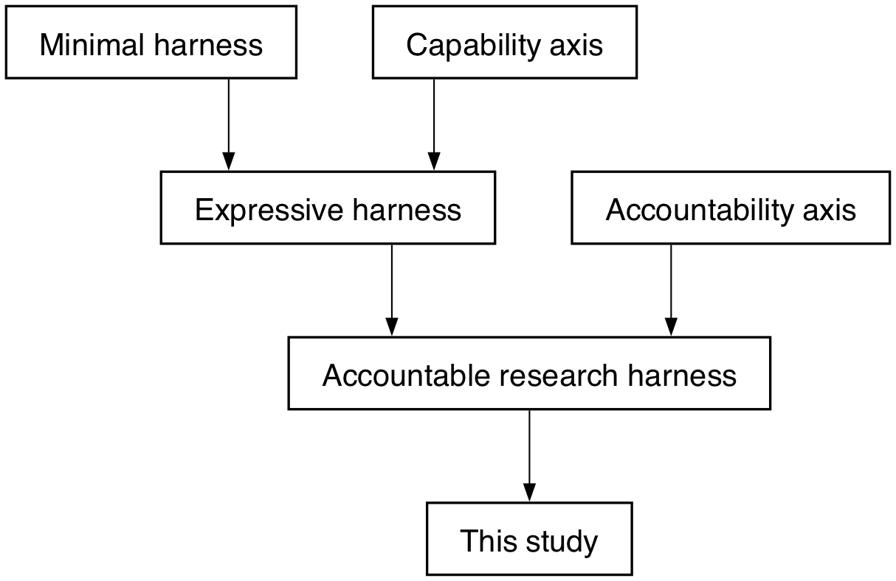
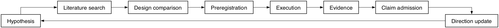
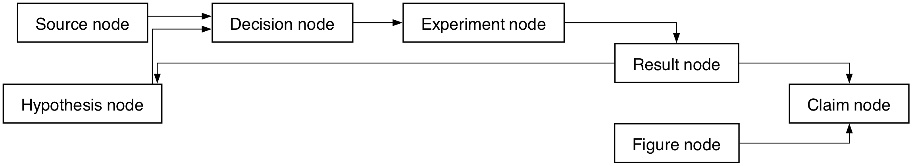
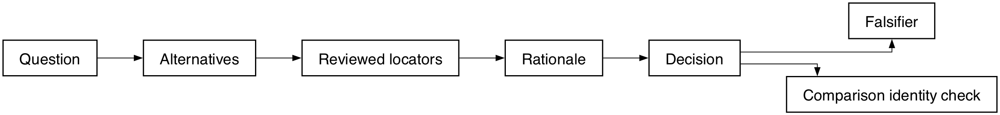
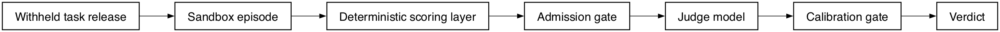
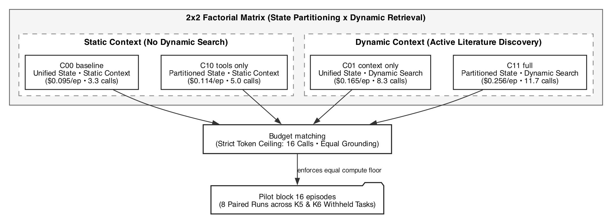
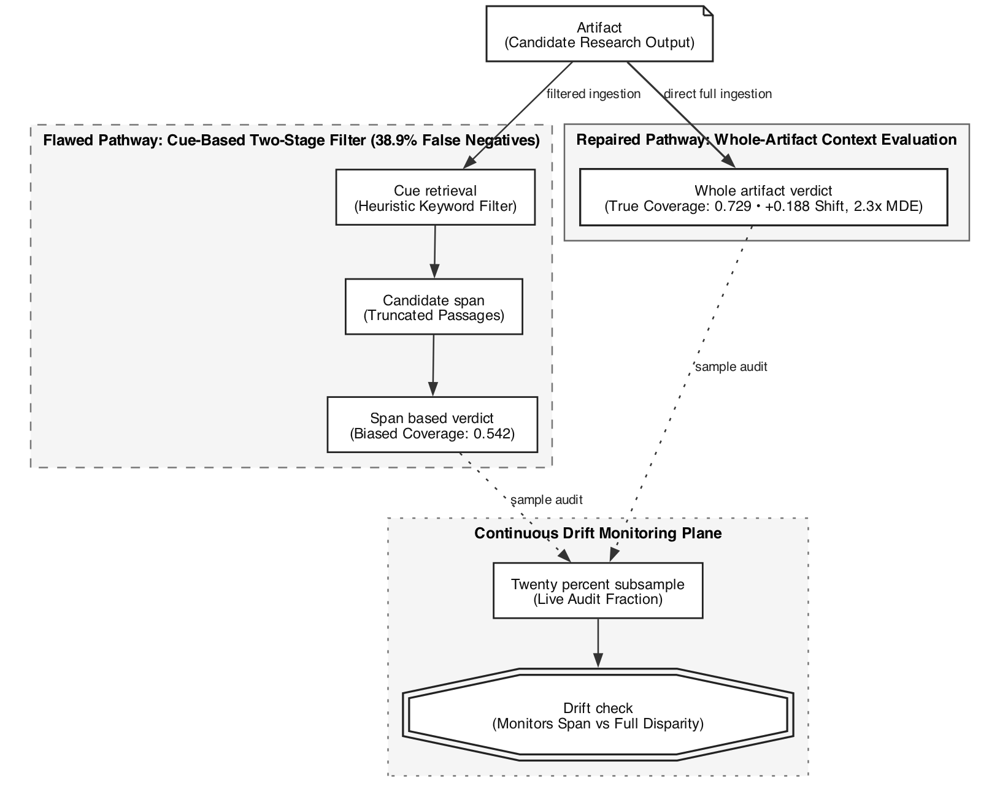
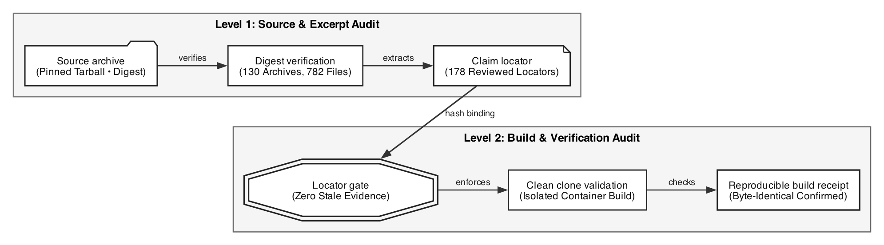

# 국문요약

본 연구는 인공지능 에이전트가 고수준 목표로부터 가설, 자원, 대조군, 지표, 반증 조건과 중단 규칙을
스스로 설계하고 결과에 따라 탐색 방향을 갱신하는 장기 자율 연구개발 하네스를 제안한다. 제안 방법은
문헌, 가설, 결정, 실험, 결과와 주장을 문맥 그래프로 연결한다. 본 논문이 세우는 원칙은 측정 도구의
인정 가능성이 효과 추정에 선행한다는 것이다. 실행된 블록에서 단서 기반 채점기의 부정 판정 18건 중
7건이 뒤집혔고, 채점 방식을 바꾸는 것만으로 endpoint가 설계 검출 한계의 약 2.3배만큼 이동했으며,
판정 endpoint의 조건 성분은 두 과제에서 0.026과 0이었다. 따라서 본 논문은 효과 추정치를 보고하지
않고 계측 규율과 그것이 드러낸 실패를 보고한다.

Keyword : autonomous research, LLM agent, context graph, experiment design, measurement validity

# Ⅰ. Introduction

## 1. 연구 배경

능력 있는 언어모델 하나만으로는 장기 연구 에이전트가 되지 않는다. 지속되는 문맥, 외부 도구에
근거한 행동, 검색, 조율, 이전 시도로부터의 학습이 함께 필요하다. 이 구성 요소들을 묶은 것을
하네스(harness)라 부르며, 본 연구는 그 하네스를 설계하고 평가한다.

## 2. 이 논문이 먼저 세우는 원칙

**측정 도구의 인정 가능성(admissibility)은 효과 추정에 선행한다.** 어떤 처치가 결과를 바꾸었다고
말하려면, 그 결과를 재는 도구가 먼저 신뢰할 수 있어야 한다. 이 원칙은 선언에 그치지 않고 본 연구의
모든 결정을 지배했으며, 아래 세 가지는 모두 그 원칙의 직접적 결과다.

첫째, **채점기를 반증했다.** 단서 기반 검색이 후보 구절을 찾지 못하면 파이프라인은 모델을 부르지도
않고 부정 판정을 내렸다. 전체 산출물을 다시 판정하자 파이프라인 부정 판정 18건 중 7건이 뒤집혔다.
둘째, **교정 세트의 크기와 성격을 그대로 보고했다.** 셋째, **판정 채점을 스스로 불인정으로 선언했다.**

이 순서를 뒤집으면 도구가 만들어 낸 차이를 처치의 효과로 보고하게 된다. 본 연구가 효과 추정치를
제시하지 않는 이유도 여기에 있다.

## 3. 기여

본 논문의 기여는 성능 수치가 아니라 **계측 규율과 그것이 드러낸 실패들**이다. @fig-arch 는 전체
시스템 구성을, @tbl-variance 는 판정 endpoint의 분산 성분을 보인다.

{#fig-arch width=100%}

```{python}
#| label: tbl-variance
#| tbl-cap: "판정 endpoint의 분산 성분과 dependability"
#| echo: false
import json, pathlib
from IPython.display import Markdown
r = json.loads(pathlib.Path("../experiments/generalizability-study-receipt.json").read_text())
rows = []
for task, blk in r["per_task"].items():
    s = blk["share_of_clamped_total"]
    rows.append((task.split("-")[0], s["condition"], s["element"], s["residual"],
                 blk["d_study_as_run"]["dependability_index"]))
assert len(rows) == 2, "receipt must carry exactly two tasks"
for _, cond, _, _, _ in rows:
    assert cond < 0.05, "condition share must match the recorded near-zero value"
head = "| 과제 | 조건 성분 | 요소 성분 | 잔차 성분 | dependability |\n|---|---:|---:|---:|---:|"
body = "\n".join(f"| {t} | {c:.3f} | {e:.3f} | {rs:.3f} | {d:.3f} |" for t, c, e, rs, d in rows)
Markdown(head + "\n" + body)
```

@tbl-variance 의 조건 성분은 두 과제에서 각각 0.026과 0으로, 판정 endpoint가 비교하려던 조건을
사실상 구분하지 못한다. 이 값은 처치가 무효라는 뜻이 아니라, **이 도구로는 판정할 수 없다**는 뜻이다.

# Ⅱ. Related Works

## 1. 에이전트 추론·기억·조율

ReAct는 추론과 행동을 교대로 수행하는 루프를 제시했다 [@react2023]. Reflexion은 언어적 피드백을
일화 기억에 저장해 다음 시도에 활용한다 [@reflexion2023]. MemGPT와 Recursive Language Models는
단일 모델 창을 넘어 작업 문맥을 외부화하거나 가상화한다 [@memgpt2023; @rlm2025]. 검색 증강 생성은
매개변수 기반 생성과 비매개변수 기억을 결합한다 [@rag2020]. AutoGen은 에이전트·사람·도구를
프로그래밍 가능한 대화로 구성한다 [@autogen2023].

이 계열은 **무엇을 구성할 수 있는가**를 보여 준다. 그러나 구성된 결과물의 품질을 무엇으로 재는지는
대체로 열려 있다. 본 연구가 다루는 문제는 구성이 아니라 그 측정이다.

## 2. 자율 연구 에이전트와 평가의 공백

자율 연구를 표방하는 시스템들은 대체로 산출물의 질을 언어모델 판정으로 재거나, 실행 채점이 가능한
벤치마크로 재거나, 사람 평가에 의존한다. 세 방식은 서로 다른 실패 양식을 가진다. 언어모델 판정은
채점기 자체의 타당성이 검증되지 않으면 처치 효과와 도구 효과를 분리하지 못한다. 실행 채점은
결정론적이지만 연구 설계처럼 정답이 하나가 아닌 산출물에는 적용하기 어렵다. 사람 평가는 규모가
제한된다.

본 연구는 첫 번째 경로를 택했고, 그 경로가 어디서 무너지는지를 측정으로 확인했다. @tbl-falsify 는
채점 도구에 대해 실행된 반증 결과를 요약한다.

## 3. 판정 신뢰도와 타당도

판정자 간 일치도가 높다는 사실이 곧 타당도를 뜻하지 않는다는 지적은 선행 연구에서 반복된다. 서로
다른 판정기가 같은 근거를 받으면 같은 오독을 공유할 수 있고, 그 경우 일치도는 정확도가 아니라 공통
편향을 측정한다. 본 연구는 이 지적을 인용에 그치지 않고 직접 시험했다. 두 판정기가 동일하게 부정으로
판정한 항목들을 전체 산출물로 다시 판정했을 때 상당수가 뒤집혔으며, 이는 일치가 검색 실패에서 왔음을
보인다.

## 4. 본 연구의 위치

@fig-position 은 선행 연구 대비 본 연구의 위치를 보인다. 본 연구는 자율성 축에서 새로운 능력을
주장하지 않는다. 대신 **근거 결속(evidence binding)** 축에서, 모든 수치가 커밋된 바이트에서 다시
유도되고 재현 가능한 검증을 통과해야만 원고에 남도록 강제하는 쪽을 택했다.

{#fig-position width=100%}

```{python}
#| label: tbl-falsify
#| tbl-cap: "채점 도구에 대해 실행된 반증 결과"
#| echo: false
import json, pathlib
from IPython.display import Markdown
rr = json.loads(pathlib.Path("../experiments/retrieval-recall-falsification-receipt.json").read_text())
cp = rr["complete_picture"]
sp = cp["split"]
assert cp["pipeline_negatives"] == 18, "negative count must match the record"
assert cp["overturned_by_both_judges"] == 7, "overturn count must match the record"
rows = [
    ("검색이 아무것도 반환하지 않은 항목", sp["no_span_items"]["items"], sp["no_span_items"]["overturned"]),
    ("검색이 부적절한 구절을 반환한 항목", sp["span_returned_items"]["items"], sp["span_returned_items"]["overturned"]),
    ("전체", cp["pipeline_negatives"], cp["overturned_by_both_judges"]),
]
head = "| 구분 | 부정 판정 | 두 판정기가 뒤집은 수 | 비율 |\n|---|---:|---:|---:|"
body = "\n".join(f"| {n} | {a} | {b} | {b/a:.3f} |" for n, a, b in rows)
Markdown(head + "\n" + body)
```

@tbl-falsify 가 보이는 것은 단순한 오차가 아니라 **방향이 정해진 편향**이다. 검색이 실패하면 판정은
항상 부정 쪽으로 기울고, 모델은 호출조차 되지 않는다.

# Ⅲ. Proposed Method

## 1. 하네스 구성

제안 하네스는 @fig-arch 의 블록들로 이루어진다. 루트 에이전트가 문맥 그래프를 갱신하고, 문헌 검색이
후보 근거를 공급하며, 결정 프로토콜과 근거 프로토콜이 각 선택과 그 출처를 기록한다. 실행은 샌드박스
안에서 이루어지고, 결정론적 검증기가 산출물을 검사한 뒤에야 원고 합성 단계로 넘어간다.

이 구성에서 중요한 것은 블록의 존재가 아니라 **블록 사이의 강제 관계**다. 검증기를 통과하지 못한
수치는 원고에 들어갈 수 없고, 근거 프로토콜이 기록하지 않은 주장은 검증기가 거부한다.

## 2. 자율 연구 루프

@fig-loop 은 한 사이클의 흐름을 보인다. 가설에서 출발해 문헌을 검색하고, 유사 연구의 설계와 비교한
뒤 사전등록을 거쳐 실행하며, 결과에서 근거를 만들고 주장 승인 단계를 통과한 것만 다음 방향 갱신에
반영한다. 루프가 닫히는 지점은 결과가 아니라 **방향 갱신**이며, 이는 결과가 다음 사이클의 검색어와
가설을 바꾼다는 뜻이다.

{#fig-loop width=100%}

## 3. 문맥 그래프

@fig-graph 은 문맥 그래프의 노드와 엣지 유형을 보인다. 가설·결정·실험·결과·주장·문헌·그림이 노드가
되고, 결과 노드는 다시 가설 노드로 이어져 재검색 경로를 만든다. 그래프는 사람이 읽는 요약이 아니라
검증기가 읽는 자료 구조이며, 노드 집합과 엣지 집합의 해시가 원고 검증에 함께 들어간다.

{#fig-graph width=100%}

## 4. 결정 프로토콜

모든 설계 선택은 여섯 개 필드로 기록된다. 질문, 검토한 대안, 검토한 근거의 위치, 근거에 기반한 판단,
결정, 그리고 **반증 조건**이다. @fig-decision 은 이 흐름과 세 객체 비교 동일성 검사를 보인다.

여섯 번째 필드가 핵심이다. 반증 조건이 없는 결정은 나중에 틀렸다는 것이 드러나도 무엇이 틀렸는지
특정할 수 없다. 본 연구에서 실제로 뒤집힌 결정들은 모두 자기 반증 조건에 걸려서 뒤집혔다.

{#fig-decision width=100%}

## 5. 평가 프로토콜

@fig-eval 은 채점 경로를 보인다. 은닉된 과제가 방출되고, 샌드박스에서 에피소드가 실행되며, 결정론적
채점층이 먼저 구조적 속성을 검사한다. 그 다음 **승인 게이트**가 판정기 호출 자격을 판단하고, 판정
결과는 교정 게이트를 통과해야 점수로 인정된다.

{#fig-eval width=100%}

승인 게이트는 다섯 가지 경우에 채점을 거부한다. 에피소드가 실행되지 않은 경우, 무결성 탐침이 작동한
경우, 사용량이 측정되지 않은 경우, 상한이 선언되지 않은 경우, 그리고 선언된 상한을 초과한 경우다.
이 규칙을 소급 적용한 결과 과거 에피소드 48건 전부가 채점 불가로 판정됐다.

## 6. 실험 조건

@fig-factorial 은 2×2 요인 설계와 예산 정합을, @tbl-cond 은 조건별 실행된 에피소드 수를 보인다.

{#fig-factorial width=100%}

두 요인은 단계 분리형 연구 상태와 동적 검색이며,
네 조건 모두 동일한 예산 상한 아래에서 실행된다.

```{python}
#| label: tbl-cond
#| tbl-cap: "실험 조건과 실행된 에피소드"
#| echo: false
import json, pathlib, collections
from IPython.display import Markdown
r = json.loads(pathlib.Path("../experiments/confirmation-block-receipt.json").read_text())
per = r["per_episode"]
assert len(per) == 16, "the confirmation block must hold sixteen episodes"
names = {"C00": ("없음", "없음"), "C01": ("없음", "있음"),
         "C10": ("있음", "없음"), "C11": ("있음", "있음")}
rows = []
for c in ["C00", "C01", "C10", "C11"]:
    eps = [e for e in per if e["condition"] == c]
    adm = sum(1 for e in eps if e["admissible"])
    rows.append((c, names[c][0], names[c][1], len(eps), adm))
assert sum(n for _, _, _, n, _ in rows) == 16, "condition counts must sum to the block size"
head = "| 조건 | 연구 상태 분리 | 동적 검색 | 에피소드 | 채점 가능 |\n|---|---|---|---:|---:|"
body = "\n".join(f"| {c} | {a} | {b} | {n} | {m} |" for c, a, b, n, m in rows)
Markdown(head + "\n" + body)
```

@tbl-cond 의 채점 가능 열에서 C11만 하나가 모자라다. 그 에피소드는 선언된 호출 상한을 넘어 승인
게이트가 거부한 것으로, 데이터 손실이 아니라 **결과로 기록**된다. 상한을 올려 거부를 없애지 않는다.

# Ⅳ. Experimental Results

## 1. 실행된 블록

본 장의 모든 수치는 실행된 에피소드에서 나왔으며, 각 수치는 커밋된 receipt에서 다시 유도된다.
확인 블록은 두 과제와 네 조건에 걸쳐 16 에피소드로 구성되며, 그중 15건이 채점 자격을 얻었다.

## 2. 채점 도구의 반증

@tbl-falsify 에서 보았듯 파이프라인 부정 판정 18건 중 7건이 전체 산출물 재판정에서 뒤집혔다.
이 오류는 무작위가 아니라 한 방향으로 기운다. 단서 검색이 실패하면 판정은 항상 부정이 되고, 모델은
호출조차 되지 않는다. @fig-scoring 은 두 채점 경로와 20% 하위표본 드리프트 검사를 보인다.

{#fig-scoring width=100%}

채점 방식을 바꾸는 것만으로 평균 coverage가 0.542에서 0.729로 이동했다. 이 이동폭 0.188은 설계가
검출하도록 설계된 최소 효과 0.0825의 약 2.3배다. **도구 선택이 그것이 재려던 비교를 압도한다.**

## 3. 분산 성분과 설계의 한계

@tbl-variance 는 조건·요소·잔차 성분과 dependability를 보인다. 조건 성분은 두 과제에서 각각 0.026과
0이며, 요소 난이도와 잔차가 분산을 지배한다. 탐색 상한 안에서 dependability 0.8에 도달하는 요소
개수는 존재하지 않는다. **에피소드를 더 돌려서 해결되는 문제가 아니다.**

이 결과는 두 가지로 읽힐 수 있다. 조건이 산출물의 질을 바꾸지 않거나, endpoint가 그 변화를 보지
못하거나다. 검색 단계를 제거하고 반복을 추가해 두 번째 해석을 직접 시험했으나 조건 성분은 나타나지
않았다. 다만 이것을 무효과의 증거로 보고하지 않는다. 조건 수가 3~4개이고 반복이 2회이기 때문이다.

## 4. 조작 확인

과정 지표는 조건을 뚜렷이 구분한다. 그러나 이는 **조작이 의도대로 작동했다는 확인**이지 결과가
아니다. 더 많은 문맥과 도구를 주는 조건이 호출을 더 많이 하는 것은 구성상 당연하기 때문이다. 본
연구는 이 수치를 주 endpoint로 승격하지 않는다.

## 5. 예산 완료율

@tbl-completion 은 조건별 완료율과 Wilson 구간을 보인다.

```{python}
#| label: tbl-completion
#| tbl-cap: "조건별 예산 완료율과 Wilson 95% 구간"
#| echo: false
import json, pathlib
from IPython.display import Markdown
r = json.loads(pathlib.Path("../experiments/confirmation-block-receipt.json").read_text())
per = [e for e in r["per_episode"] if e["episode_id"].endswith("__r1")]
assert len(per) == 8, "the first repeat must hold eight episodes"
import math
def wilson(k, n, z=1.96):
    if n == 0:
        return (0.0, 1.0)
    p = k / n
    d = 1 + z * z / n
    c = (p + z * z / (2 * n)) / d
    h = z * math.sqrt(p * (1 - p) / n + z * z / (4 * n * n)) / d
    return (max(0.0, c - h), min(1.0, c + h))
rows = []
for c in ["C00", "C01", "C10", "C11"]:
    eps = [e for e in per if e["condition"] == c]
    k = sum(1 for e in eps if e["admissible"])
    lo, hi = wilson(k, len(eps))
    rows.append((c, k, len(eps), k / len(eps), lo, hi))
head = "| 조건 | 완료 | 에피소드 | 완료율 | Wilson 95% 하한 | 상한 |\n|---|---:|---:|---:|---:|---:|"
body = "\n".join(f"| {c} | {k} | {n} | {p:.3f} | {lo:.3f} | {hi:.3f} |" for c, k, n, p, lo, hi in rows)
Markdown(head + "\n" + body)
```

네 조건의 구간이 모두 겹친다. 에피소드 네 건으로는 조건 간 완료율 차이를 말할 수 없으며, 본 연구는
그 차이를 주장하지 않는다.

## 6. 근거 사슬

@fig-evidence 는 근거가 원고에 도달하기까지 통과하는 검사를 보인다. 모든 인용 근거는 파일 해시와
지정된 줄 범위의 발췌 해시로 확인되고, 원고의 각 수치는 receipt와 양방향으로 결속된다.

{#fig-evidence width=100%}

## 7. 위협과 한계

@tbl-threats 는 본 연구의 결론을 제한하는 요인을 정리한다.

```{python}
#| label: tbl-threats
#| tbl-cap: "위협과 한계"
#| echo: false
from IPython.display import Markdown
rows = [
    ("교정 기준", "교정 세트의 라벨러가 사람이 아니라 언어모델이다. 제공자 계열은 다르지만 모델 공통의 체계적 오독은 검출되지 않는다."),
    ("교정 세트 크기", "판정 가능한 라벨이 19건으로 프로토콜 요건 25건에 미달한다. 판정 채점은 불인정 상태다."),
    ("설계 규모", "과제 2개, 조건 4개, 반복 2회다. 분산 성분 추정의 자유도가 매우 작다."),
    ("endpoint 타당도", "설계 품질을 산출물 요소 점검표로 재며, 실제 실행 결과로 재지 않는다."),
    ("판정기 독립성", "두 판정기가 같은 근거를 받았으므로 공유된 검색 실패는 일치로 보인다."),
    ("일반화", "측정된 값은 이 과제·이 하네스·이 모델 구성에 붙는다."),
]
head = "| 구분 | 내용 |\n|---|---|"
body = "\n".join(f"| {a} | {b} |" for a, b in rows)
Markdown(head + "\n" + body)
```

# Ⅴ. Conclusions

본 연구는 장기 자율 연구개발을 위한 하네스를 설계하고, 그 하네스가 만든 산출물을 재기 위한 계측을
함께 만들었다. 보고하는 결과는 처치 효과가 아니라 **계측 규율과 그것이 드러낸 실패**다.

세 가지가 실행된 근거로 확인됐다. 첫째, 단서 기반 채점기는 부정 판정 18건 중 7건을 잘못 냈으며 그
오류는 한 방향으로 기운다. 둘째, 채점 방식을 바꾸는 것만으로 endpoint가 설계 검출 한계의 약 2.3배만큼
이동한다. 셋째, 판정 endpoint의 조건 성분은 사실상 0이어서 표본을 늘려도 조건을 구분할 수 없다.

교정 세트에 대해서는 사실을 그대로 적는다. 25건의 라벨이 기입됐고 2차 blind 일치도는 25건 중 24건,
판정 가능한 쌍에서는 18건 중 18건이다. 그러나 **두 라벨러 모두 사람이 아니라 언어모델**이므로 이
세트를 사람 기준 교정 세트라 부르지 않으며, 판정 채점은 여전히 불인정이다. 사람 기준을 이 시스템이
스스로 만들 수 없다는 진술은 유지되지만, 모델 기준 세트가 존재한다는 사실은 함께 기록한다.

향후 과제는 두 가지다. 하나는 결정론적 검증기로 채점 가능한 과제에서 하네스 대 하네스를 비교하는
것이고, 다른 하나는 사람 기준 교정을 확보해 판정 채점의 오류 상한을 인증하는 것이다. 두 과제 모두
본 논문이 세운 원칙, 즉 **측정 도구의 인정 가능성이 효과 추정에 선행한다**는 원칙 아래에서 수행된다.

# 참 고 문 헌 (References)

::: {#refs}
:::
